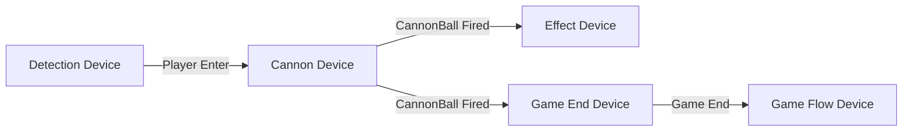

# 장치 시스템
장치는 불카누스를 구성하는 "기능을 가진 게임 오브젝트" 입니다.  
사용자는 장치를 이용하여 플레이어와의 상호작용 및 게임 이벤트를 구성할 수 있습니다.  
만들어 제공되는 장치를 그대로 사용할 수도 있고, 장치의 구성과 동작 옵션을 변경할 수도 있습니다. 
또한 사용자가 직접 장치를 만들어 사용할 수도 있습니다.

## 장치 제작

불카누스의 장치는 비주얼 스크립트를 통해 만들어집니다.
게임 템플릿에 포함되어 있는 대부분의 장치들 역시 비주얼 스크립트로 제작했습니다. 

## 장치 핵심 특징

장치가 가지는 핵심 특징은 장치 간 이벤트를 통한 연결입니다.  
어떠한 장치에서 이벤트가 발생하면 그 장치의 이벤트를 받아 또 다른 장치를 동작시킬 수 있습니다.
하나의 게임에서 장치들이 어떻게 연결될 수 있는지 간단한 예시를 통해 살펴보겠습니다.

- 게임 플레이어가 감지 장치 위에 올라섭니다..
- 감지 장치에서 Player Enter 이벤트가 발생합니다.
- 감지 장치의 Player Enter 이벤트를 구독하고 있는 이펙트 장치와 게임 종료 장치가 동작합니다.
  - 이펙트 장치는 이펙트를 플레이 합니다.
  - 게임 종료 장치는 Game Flow에 해당 게임을 종료하라는 메시지를 보냅니다.

## 장치 분류

장치는 여러 기준을 가지고 분류할 수 있습니다.  
간단하게는 장치의 제작 주체에 따라 분류할 수도 있고, 장치의 기능을 기준으로 분류할 수도 있습니다. 

### 제작 주체에 따른 분류

장치를 누가 만들었냐에 따라서 아래와 같이 분류할 수 있습니다.
- **공식 장치:** 미리 제작되어 게임 템플릿 등을 통해 배포되는 장치. 
- **커스텀 장치:** 사용자가 직접 만들어 사용하는 장치.

### 기능에 따른 분류

장치가 가지는 기능에 따라서 크게 아래와 같이 분류할 수 있습니다.
- **시스템 장치:** 불카누스의 기반 시스템과 연동된 장치. 게임의 기본 Flow, 매칭 등 게임의 핵심 역할을 담당. 
- **컨텐츠 장치:** 게임의 기능을 동작시키는 장치. 타이머, 체크포인트 등 게임을 동작시키는 역할 담당.
- **기믹 장치:** 점프 장치, 대포 발사 장치 등 게임의 컨텐츠를 구성하는 역할을 담당.

## 참고

- [비주얼 스크립팅](Visual-Scripting.md)
- [나만의 장치 제작하기](How-to-Create-Custom-Device.md)
- [장치 시스템](Devices.md)