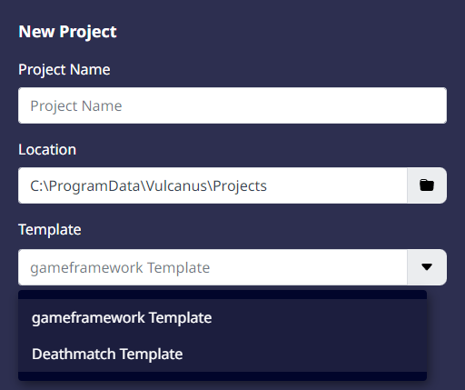
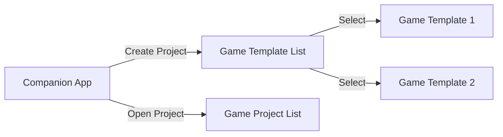

# 게임 템플릿

'게임 템플릿' 게임 개발을 시작할 때 참고할 수 있도록 기본적인 구조와 기능을 미리 구성해 제공한 샘플 게임을 말합니다.  
이 게임 템플릿을 사용해 이미 만들어진 기능을 확인하고, 이를 응용해 보다 손쉽게 개발을 진행할 수 있습니다.   
게임 템플릿의 주요 기능은 아래와 같습니다. 

## 게임 템플릿의 주요 기능

1. **게임 기본 구조 제공:** 각 템플릿은 해당되는 게임의 기본적인 동작 구조를 포함하고 있습니다.  
게임 템플릿을 통해이러한 구조를 파악하면 보다 손쉽게 원하는 게임을 만들 수 있습니다. 

2. **게임 필수 요소 포함:** 게임 템플릿에는 게임 제작에 필수적인 것들이 포함되어 있습니다.   
캐릭터, 카메라, UI 등 게임 제작에 필수적인 기능을 가지는 것들을 즉시 사용 가능한 형태로 제작되어 있습니다. 
 
3. **각종 리소스 포함:** 게임을 꾸미는데 사용할 수 있는 각종 그래픽 리소스 및 사운드가 포함되어 있습니다. 사용자는 제공된 리소스를 활용해 게임을 취향에 맞도록 디자인할 수 있습니다.

## 게임 템플릿 제공 방식

불카누스에서는 불카누스 런처를 통해 게임 템플릿을 제공하고 있습니다.
불카누스 런처를 통해 원하는 게임 템플릿을 선택해 프로젝트를 생성할 수 있습니다.

{width="400"}

## 컴패니언 앱 사용 Flow

불카누스 컴패니언 앱을 통해 새로운 프로젝트를 생성하거나, 기존에 만들어둔 프로젝트를 선택해 오픈할 수 있습니다. 

불카누스 컴패니언 앱의 기본적인 사용흐름은 위와 같습니다.

## 참고

- [불카누스 컴패니언 앱](CompanionApp.md)