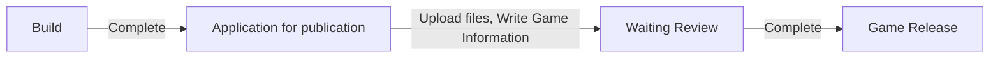

# 출판과 플레이

게임을 만드는 작업 만큼 중요한 것은 만든 게임을 배포하는 작업 입니다.    
보통의 경우 직접 만든 게임을 배포 하는 것은 매우 복잡하고 번거로운 작업의 연속입니다.  
불카누스에서는 이러한 번거로운 배포 과정을 단순화하여, 쉽고 빠르게 게임을 배포할 수 있도록 관련 기능을 제공하고 있습니다.
게임을 배포하는 과정 일체를 불카누스에서는 '출판' 이라고 부릅니다. 

출판의 과정은 크게 아래와 같이 구분됩니다.

1. **빌드하기:** 지금까지 만든 게임을 출판하기 위해 준비하는 과정입니다. 이 과정을 진행하면 출판 준비된 파일이 생성됩니다. 
2. **출판 신청:** 준비된 게임 파일을 업로드하고 게임 출판에 필요한 각종 정보를 입력하는 단계입니다. 
3. **심사 대기:** 만들어진 게임이 공개에 적합한 게임인지, 잘못 만들어진 부분은 없는지를 심사하는 과정입니다. 짧게는 몇 시간에에서 길게는 며칠 정도 소요됩니다. 
4. **Project B 에 전시:** 게임이 정상적으로 심사를 통과하면 수공성구 내 행성유랑을 통해 게임이 공개됩니다. 

## 참고
- [게임 출판 매뉴얼](Publish-MOD.md)