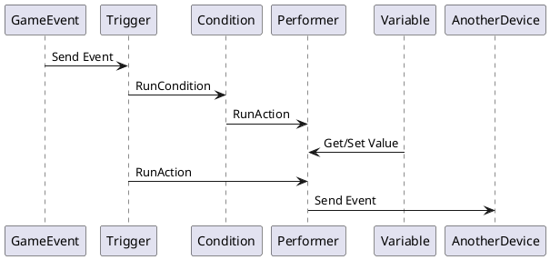
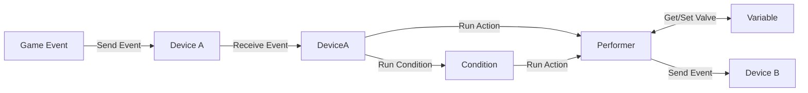
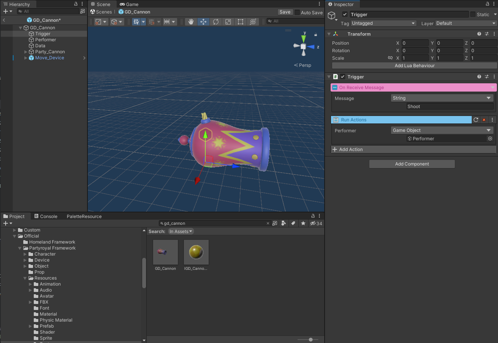

# 비주얼 스크립팅

불카누스는 Lua Script를 사용해 게임을 개발할 수 있는 창작 도구입니다.  
다만 Lua Script 사용이 어려운 사용자들을 위해 비주얼 스크립트를 통해서도 게임을 제작할 수 있는 기능을 지원하고 있습니다.  
게임 템플릿을 통해 제공되는 각종 장치들도 비주얼 스크립트를 이용해 제작되었습니다.

## 비주얼 스크립트 핵심 개념

비주얼 스크립트는 아래의 4가지 모듈을 기반으로 개발되었습니다.
1. **Trigger :** 각종 이벤트를 전달받을 수 있는 모듈입니다. 게임 시작, 종료 등 게임 플로우에서 발생되는 이벤트 뿐 아니라 각종 장치에서 발생되는 이벤트를 전달받을 수 있습니다.
2. **Performer :** 게임을 직접적으로 동작시키는 모듈입니다. 게임 오브젝트를 움직이거나, 소리를 내거나, 다른 장치들에 이벤트를 보내는 등의 기능이 여기에 속합니다.
3. **Condition :** 조건을 비교하는 로직과 관련된 모듈입니다. 어떠한 값 들을 비교해 그 결과에 따라 다른 기능들을 동작시키는데 필요한 개념입니다.
4. **Variable :** 사용자가 정의한 다양한 값을 이 모듈에 저장해 편리하게 사용할 수 있습니다.
Variable 모듈을 잘 사용하면 비주얼 스크립트를 직접적으로 사용하지 않고, 간단한 값의 변경만으로도 각종 장치들의 동작을 변경할 수 있습니다.

## 비주얼 스크립트 동작 Flow

게임이벤트와 장치 간 비주얼 스크립트가 동작하는 흐름을 간략히 포현하면 아래와 같습니다.

1. 게임이 동작하는 중에 어떠한 이벤트가 발생하면 장치에 속한 Trigger 모듈에서 이벤트를 받게 됩니다.
2. Trigger 모듈에서 직접 Performer 모듈을 동작시키거나, 또는 Condition 모듈을 호출합니다.
   - Condition 모듈이 호출되면 설정된 조건에 따라 연결된 Performer 모듈을 동작시킵니다.
3. Performer 모듈이 동작할 때 Variable 모듈에 포함된 여러 값 들을 참조하거나 변조할 수 있습니다.
4. Performer 모듈이 가진 여러 기능 중 하나는 다른 장치들에게 이벤트를 보낼 수 있는 기능입니다. 이 기능을 이용해 다른 장치에 이벤트를 보낼 수 있습니다.

위와 같은 동작 구조를 응용해 여러 다양한 기능을 가지는 장치들을 제작하고, 장치 간 이벤트를 주고받아 게임을 완성할 수 있습니다.

## 비주얼 스크립트 제작

비주얼 스크립트는 Unity Engine 의 게임 오브젝트를 기반으로 제작할 수 있습니다.
비주얼 스크립트를 간결하게 제작할 수 있도록, 불카누스에서는 하나의 게임 오브젝트가 하나의 모듈만을 가질 수 있도록 설계했습니다.

## 참고

- [장치 시스템](Device-System.md)