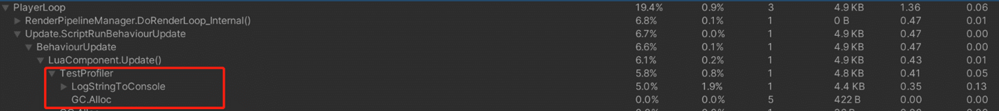

# BeginSample

## 설명

프로파일러의 시작점을 표시합니다

## 선언

LuaProfiler.BeginSample(int index)

## 주의사항
|    **함수 동작 환경**    | **동작 여부** |
|:------------------:|:---------:|
| ```Client Logic``` |  ```O```  |
| ```Server Logic``` |  ```X```  |

이 세 가지 API는 함께 사용해야 합니다.  
[GetID](GetID.md)  
[BeginSample](BeginSample.md)  
[EndSample](EndSample.md)


## Parameter
| **형식** |      **파라미터**       |   **설명**   |
|:------:|:---:|:---:|
|  int   | index | 프로파일러의 인덱스 | 

---
## Sample Code
태그가 지정된 코드의 오버헤드는 프로파일러 창에서 확인할 수 있습니다.

```lua
local LuaProfiler = LuaFramework.Runtime.Misc.LuaProfiler
 
function this.Start()
    LuaProfiler.GetID("TestProfiler")
end
 
function this.Update()
    LuaProfiler.BeginSample(0)
    print("TestProfiler")
    LuaProfiler.EndSample()
end
```