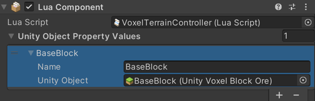

# AddBlocks

## 설명
지정된 위치에 복셀을 추가합니다.


## 선언
TerrainServiceUtility.AddBlocks (UnityVoxelBlockBase blockAsset, params Vector3 positions)

## 주의사항
|    **함수 동작 환경**    | **동작 여부** |
|:------------------:|:---------:|
| ```Client Logic``` |  ```O```  |
| ```Server Logic``` |  ```X```  |

params 키워드를 사용하는 매개변수는 배열 유형에 직접 전달할 수 없습니다. 먼저 배열을
Table 로 변환한 다음 table.unpack 을 사용하여 매개변수를 전달하십시오
터레인 API 를 사용하기 위해 TerrainServiceUtility 를 바인딩해야 하며,
사용자 입력을 감지하려면 UnityEngine.Input 에 바인딩해야 합니다.
UnityEngine.KeyCode(키보드 입력 감지가 필요할 시 등록)



## Parameter
|   **형식**   |      **파라미터**       |   **설명**   |
|:----------:|:-------------------:|:----------:|
| UnityVoxelBlockBase | blockAsset | 추가해야 하는 복셀 |
| Vector3[] |positions | 복셀을 추가하는 위치 |

## Return
|     **형식**     |  **파라미터**   |                **설명**                |
|:--------------:|:-----------:|:------------------------------------:|
|bool |boolean | 	부울 값을 반환하여 메서드가 성공적으로 실행되었는지 호출자에게 알립니다 |

---
## Sample Code
```lua
local TerrainServiceUtility = USGFramework.Runtime.USGVoxelTerrain.ServiceFunctions.TerrainServiceUtility
local Input = UnityEngine.Input
local currentBlockAsset
 
function this.Start()
    currentBlockAsset = thisLuaComponent:GetUnityObjectPropertyValueByIndex(0).UnityObject
end
 
function this.Update()
    if(Input.GetMouseButtonDown(0)) then
        local camera = UnityEngine.Camera.main
        local ray  = camera:ScreenPointToRay(Input.mousePosition)
        local flag, hit = UnityEngine.Physics.Raycast(ray, nil, 5000)
        if flag  then
            local pos = hit.point
            pos = pos + hit.normal * 0.5
            TerrainServiceUtility.AddBlocks(currentBlockAsset, pos)
        end
    end
end
```