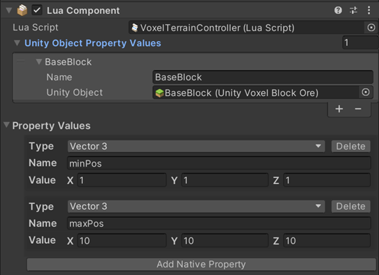

# AddBlocksByAABB

## 설명
AABB(Axis-Aligned Bounding Box) 영역에 복셀을 추가 합니다.

## 선언
TerrainServiceUtility. AddBlocksByAABB (UnityVoxelBlockBase blockAsset, Vector3 minPosition, Vector3 maxPosition)

## 주의사항
|    **함수 동작 환경**    | **동작 여부** |
|:------------------:|:---------:|
| ```Client Logic``` |  ```O```  |
| ```Server Logic``` |  ```X```  |

지정된 바운딩 박스의 영역에 복셀을 추가합니다.
--먼저, Lua Behaviour 컴포넌트에 복셀 리소스를 추가하여 대각선의 두 점을 지정합니다
참고: 터레인 API 를 사용하려면 TerrainServiceUtility 를 바인딩해야 합니다.


## Parameter
|       **형식**        |  **파라미터**  |   **설명**   |
|:-------------------:|:----------:|:----------:|
| UnityVoxelBlockBase | blockAsset | 추가해야 하는 복셀 |
|       Vector3       |   minPosition   |   바운딩 박스의 최소 위치    |
|         Vector3      |  maxPosition   |   바운딩 박스의 최대 위치    |

## Return
| **형식** | **파라미터** |                 **설명**                  |
|:------:|:--------:|:---------------------------------------:|
|  bool  | boolean  | 	메서드가 성공적으로 실행되었는지 여부를 호출자에게 알려주는 Bool 값을 반환합니다 |


## Sample Code
```lua
local TerrainServiceUtility = USGFramework.Runtime.USGVoxelTerrain.ServiceFunctions.TerrainServiceUtility
local Input = UnityEngine.Input
local blockAsset
 
function this.Update()
    if(Input.GetMouseButtonDown(0)) then
        blockAsset = thisLuaComponent:GetUnityObjectPropertyValueByIndex(0).UnityObject
        local minPos = thisLuaComponent:GetNativePropertyByIndex(0).Value
        local maxPos = thisLuaComponent:GetNativePropertyByIndex(1).Value
        TerrainServiceUtility.AddBlocksByAABB(blockAsset, minPos, maxPos)
    end
end
```