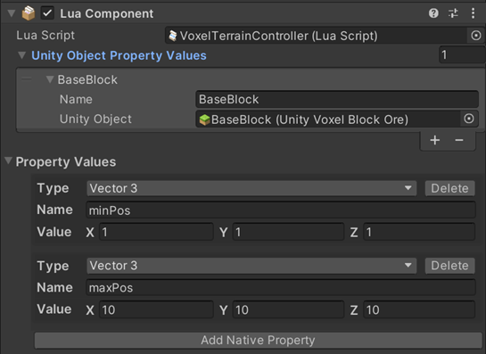

# DeleteBlocksByAABB

## 설명
호출자가 대각선의 두 점을 지정하면 이 함수는 입방체 영역을 생성한 후, 이 영역의 복셀을
삭제합니다. 호출자는 깨지기 쉬운 복셀만 삭제할지 선택할 수 있습니다.

## 선언
TerrainServiceUtility.DeleteBlocksByAABB(Vector3 minPosition, Vector3 maxPosition, bool onlyBreakable = false)

## 주의사항
|    **함수 동작 환경**    | **동작 여부** |
|:------------------:|:---------:|
| ```Client Logic``` |  ```O```  |
| ```Server Logic``` |  ```X```  |
정된 바운딩 박스 영역 내의 복셀을 삭제합니다.
먼저, Lua Behaviour 에서 대각선의 두 점을 지정합니다.
Terrain API를 사용하기 위해서는 TerrainServiceUtility를 등록해야 합니다



## Parameter
|       **형식**        |  **파라미터**  |   **설명**   |
|:-------------------:|:----------:|:----------:|
|Vector3 | minPosition | 바운딩 박스의 최소 위치 |
|Vector3 | maxPosition |  바운딩 박스의 최대 위치 |
|bool | onlyBreakable |  (선택 가능) 깨지기 쉬운 복셀만 삭제할지 여부 |

## Return
| **형식** | **파라미터** |                 **설명**                  |
|:------:|:--------:|:---------------------------------------:|
|  bool  | boolean  | 부울 값을 반환하여 메서드가 성공적으로 실행되었는지 호출자에게 알립니다 |


## Sample Code
```lua
local TerrainServiceUtility = USGFramework.Runtime.USGVoxelTerrain.ServiceFunctions.TerrainServiceUtility
local Input = UnityEngine.Input
 
function this.Update ()
    if(Input.GetMouseButtonDown(0)) then
        local minPos = thisLuaComponent:GetNativePropertyByIndex(0).Value
        local maxPos = thisLuaComponent:GetNativePropertyByIndex(1).Value
        TerrainServiceUtility. DeleteBlocksByAABB(minPos, maxPos)
    end
end
```