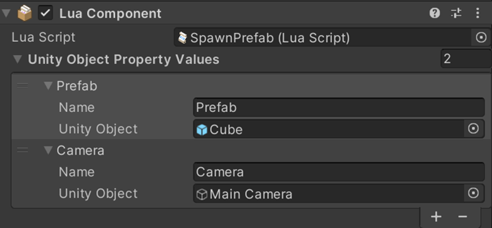

# GetAllUnityObjectPropertyValue

## 설명
> Lua Behaviour 컴포넌트의 Unity Object Property Values 컬렉션 내의 모든 오브젝트 얻습니다.
## 선언
> thisLuaComponent: GetAllUnityObjectPropertyValue ()
## 주의사항
|    **함수 동작 환경**    | **동작 여부** |
|:------------------:|:---------:|
| ```Client Logic``` |  ```O```  |
| ```Server Logic``` |  ```X```  |

> 해당 기능은 객체에  Lua Behaviour 컴포넌트가 추가되어 있어야 합니다.
>먼저, 대응하는 GameObjects 를 Lua Behaviour 컴포넌트에 마운트해야 합니다
> 

## Parameter
|     **형식**     | **파라미터** |                       **설명**                        |
|:--------------:|:--------:|:---------------------------------------------------:|
| UnityObject[ ] |  UnityObjectProperty   | RUnity Object Property 의 배열을 반환합니다. |


---
## Sample Code
```lua
local allUnityObjectProperty

function this.Start()
    allUnityObjectProperty = thisLuaComponent:GetAllUnityObjectPropertyValue()
    
    for i = 0, allUnityObjectProperty.Length - 1 do
        print("unity object property name: " .. allUnityObjectProperty[i].Name)
    end
end
```