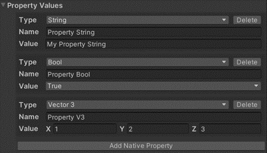

# GetNativePropertyByIndex


## 설명
> 인덱스를 통해 Lua Behaviour 컴포넌트의 Property Values 컬렉션 내에 지정된 프로퍼티를 얻습니다.
## 선언
> thisLuaComponent: GetNativePropertyByIndex (int index)
## 주의사항
|    **함수 동작 환경**    | **동작 여부** |
|:------------------:|:---------:|
| ```Client Logic``` |  ```O```  |
| ```Server Logic``` |  ```X```  |

> 해당 기능은 객체에  Lua Behaviour 컴포넌트가 추가되어 있어야 합니다.
> 먼저, 대응하는 GameObject 를 Lua Behaviour 컴포넌트에 마운트해야 합니다
> 

## Parameter
| **형식** | **파라미터** | **설명** |
|:------:|:--------:|:------:|
| index  |   int    | 인덱스 값  |


## Return
|     **형식**     |  **파라미터**   |                **설명**                |
|:--------------:|:-----------:|:------------------------------------:|
| NativeProperty | CustomValue | 	인덱스 값을 통해 찾은 Unity Property 를 반환합니다 |


---
## Sample Code
```lua
local myProperty
function this.Start()
    myProperty = thisLuaComponent:GetNativePropertyByIndex(0)
    print(myProperty.Value)
end
```
