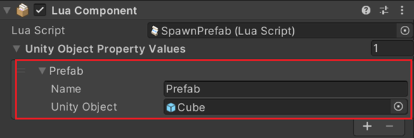

# GetUnityObjectPropertyValueByName

## 설명
> 프로퍼티 이름을 통해 Lua Behaviour 컴포넌트의 Unity Object Property Values 컬렉션 내에 지정된 오브젝트를 얻습니다.
## 선언
> thisLuaComponent: GetUnityObjectPropertyValueByName (string name)
## 주의사항
|    **함수 동작 환경**    | **동작 여부** |
|:------------------:|:---------:|
| ```Client Logic``` |  ```O```  |
| ```Server Logic``` |  ```X```  |

> 해당 기능은 객체에  Lua Behaviour 컴포넌트가 추가되어 있어야 합니다.
> 먼저, 대응하는 GameObject 를 Lua Behaviour 컴포넌트에 마운트해야 합니다
> 

## Parameter
| **형식** | **파라미터** |                       **설명**                        |
|:------:|:--------:|:---------------------------------------------------:|
| name  |   string   | 얻어야 하는 Unity Object Property 의 프로퍼티 이름입니다 |


## Return
|       **형식**        |  **파라미터**   |                   **설명**                    |
|:-------------------:|:-----------:|:-------------------------------------------:|
| UnityObjectProperty | UnityObject | 	프로퍼티 이름을 통해 찾은 Unity Object Property 를 반환합니다.|


---
## Sample Code
```lua
local currentPrefab
function this.Start()
    currentPrefab = thisLuaComponent:GetUnityObjectPropertyValueByName (“Prefab”).UnityObject
    print(currentPrefab.name)
end
```