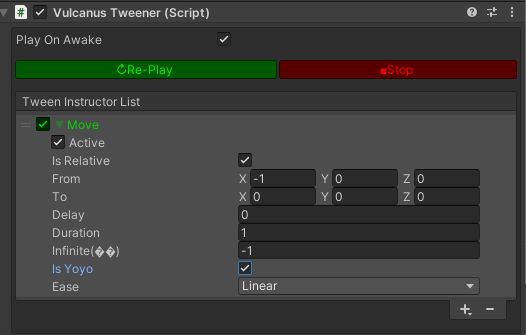

# StopTween
## 설명
> VulcanusTweener 컴포넌트에서 실행되고 있는 Tween 의 동작을 정지 합니다.
## 선언
> 설정된 Tween 을 실행합니다.  먼저 객체에 VulcanusTweener 컴포넌트를 추가 하고 Tween 설정을 합니다.
## 주의사항
|    **함수 동작 환경**    | **동작 여부** |
|:------------------:|:---------:|
| ```Client Logic``` |  ```O```  |
| ```Server Logic``` |  ```X```  |
> Tweener 기능은 객체에 VulcanusTweener 컴포넌트가 추가되어 있어야 합니다.
> 

---
## Sample Code
```lua
function this.OnCollisionEnter(collision)
    tweener = thisTransform:GetComponent("VulcanusTweener") 
    tweener:StopTween()
end
```
