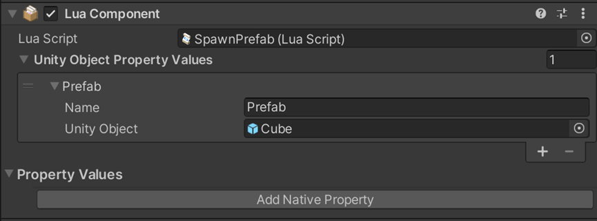

# Instantiate

## 설명

네트워크 오브젝트를 생성합니다. (참고: 이 오브젝트는 모든 클라이언트의 시스템에 동기화될 것이며 API 를 호출한 클라이언트가 UnityEngine.GameObject.Instantiate 오브젝트의 소유권을 갖습니다.)

## 선언

NetworkUtility.Instantiate (GameObject prefab, LuaFunction onGameObjectSpawned, bool destroyWithOwner = false)

NetworkUtility.Instantiate (GameObject prefab , Vector3 position, Quaternion rotation, LuaFunction onGameObjectSpawned, bool destroyWithOwner = false)

## 주의사항
|    **함수 동작 환경**    | **동작 여부** |
|:------------------:|:---------:|
| ```Client Logic``` |  ```O```  |
| ```Server Logic``` |  ```X```  |

스크립트를 빈 오브젝트에 나누어 마운트한 후 Space 키를 누르면 네트워크 오브젝트가 생성됩니다.



## Parameter
|   **형식**    |         **파라미터**         |                              **설명**                               |
|:-----------:|:------------------------:|:-----------------------------------------------------------------:|
| GameObject  |          prefab          |                            복사할 기존 오브젝트                            | 
|   Vector3   |         Vector3          |                            새로운 오브젝트 위치                            | 
| Quaternion  |        Quaternion        |                           	새로운 오브젝트 방향                            | 
| LuaFunction |   onGameObjectSpawned    |                 콜백 함수이며 파라미터는 생성된 GameObject 입니다.                 | 
|    bool     | destroyWithOwner = false | 클라이언트의 연결이 끊어졌을 때 신규 오브젝트 삭제 여부(이 파라미터는 선택 사항이며기본적으로 false 로 설정됨) | 

## Return
| **형식** | **파라미터** |                               **설명**                               |
|:------:|:--------:|:------------------------------------------------------------------:|
|  Boolean  |  Delete  | 클라이언트의 연결이 끊어졌을 때 신규 오브젝트 삭제 여부(이 파라미터는 선택 사항이며 기본적으로 false 로 설정됨) |

---
## Sample Code

```lua
local NetworkUtility = USGFramework.Runtime.Core.USGNetwork.NetworkUtility
local Input = UnityEngine.Input
local currentGameObject
local currentPrefab
 
function this.Start()
    currentPrefab = thisLuaComponent:GetUnityObjectPropertyValueByName("Prefab").UnityObject
end
 
function this.Update()
    if Input.GetKeyDown("space") then
        NetworkUtility.Instantiate(currentPrefab, Vector3(0, 3, 0), Quaternion.identity, this.OnObjectSpawned, true)
    end
end
 
function this.OnObjectSpawned(spawnedObject)
    currentGameObject = spawnedObject;
    print('OnObjectSpawned ' .. currentGameObject.name);
end
```