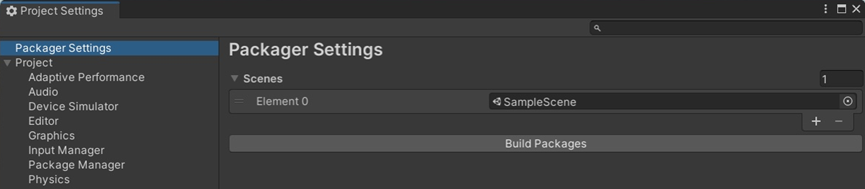

# LoadScene

## 설명

씬 이름으로 씬을 로드합니다.

서버가 씬을 로드하면 모든 클라이언트가 대기씬에 들어가며, 현재 씬은 제거됩니다.

이 방법은 클라이언트가 단독으로 씬을 로드하는 것을 지원하지 않습니다

## 선언

NetworkUtility.LoadScene(string sceneName)

## 주의사항
|    **함수 동작 환경**    | **동작 여부** |
|:------------------:|:---------:|
| ```Client Logic``` |  ```O```  |
| ```Server Logic``` |  ```X```  |
임의의 객체에 스크립트를 마운트합니다. Edit->Project Settings->Packager
Settings 에서 패키징해야 하는 씬을 설정합니다. 이 메서드를 호출하면 모든 클라이언트가 새
씬으로 로드됩니다



## Parameter
|   **형식**   |      **파라미터**       |   **설명**   |
|:---:|:---:|:---:|
| string | sceneName | 씬이름 | 

## Return
|**형식**| **파라미터** |                    **설명**                    |
|:---:|:--------:|:--------------------------------------------:|
|Boolean |  Result  | 메서드가 성공적으로 실행되었는지 여부를 호출자에게 알리는 부울 값을 반환합니다. |

---
## Sample Code
```lua
local NetworkUtility = USGFramework.Runtime.Core.USGNetwork.NetworkUtility
local Input = UnityEngine.Input
 
function this.Update()
    if Input.GetKeyDown("space") then
        NetworkUtility.LoadScene(“NewScene”)
    end
end
```