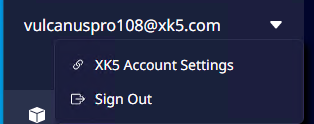

# 계정

## 계정 드롭 다운 메뉴

 {width="400"}

| **메뉴**               | **설명**                                   |
|:---------------------|:-----------------------------------------|
| XK5 Account Settings | XK5 개발자 센터 내 계정 관리페이지를 새 브라우저로 열 수 있습니다. |
| Sign Out             | 현재 접속된 계정을 컴패니언 앱에서 로그아웃 합니다.            |

'Sign Out' 메뉴를 클릭하면 현재 열려있는 프로젝트의 저장/종료 팝업을 확인한 후 에디터를 종료합니다.  
에디터가 종료되면 계정이 로그아웃되며, 로그인 화면으로 돌아갑니다.