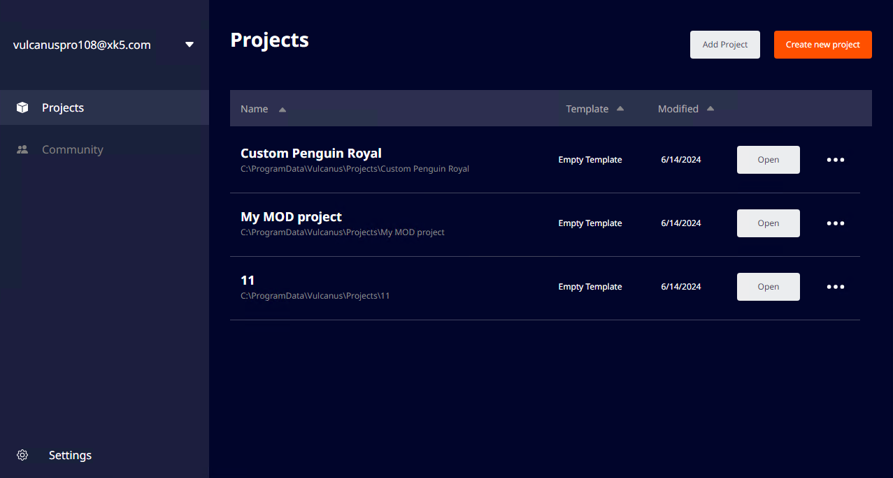
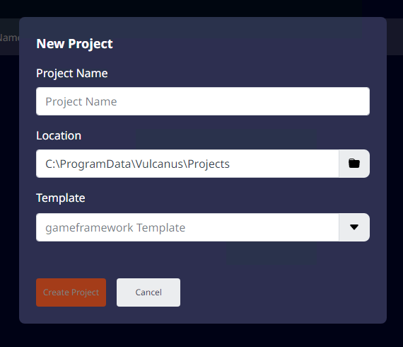

# 프로젝트
 {width=900}

## 프로젝트 생성

### 템플릿으로 생성

 {width=400}

'Create New Project' 버튼을 클릭하여 불카누스 게임프레임워크가 적용된 게임 프로젝트를 만들 수 있습니다.  
프로젝트의 이름을 입력하면 'Create'버튼이 활성화되고 클릭하면 프로젝트가 생성됩니다.
프로젝트를 생성하면 프로젝트 리스트에 등록되며, 프로젝트 생성이 완료되면 불카누스 에디터가 실행됩니다.  

#### 프로젝트 생성 기능

1. **템플릿 선택:** 불카누스 게임프레임워크를 사용할 수 있는 템플릿을 선택할 수 있습니다. 현재는 'gameframework Template'을 지원합니다.  
2. **프로젝트 생성 경로 확인 및 변경:** 불카누스 프로젝트는 기본적으로 '%LocalAppdata%/ProgramData\Vulcanus\Projects' 하위에 생성됩니다. 경로가 표시된 필드를 클릭하면 원하는 위치에 프로젝트를 생성할 수 있습니다.

## 기존 프로젝트 추가

프로젝트 리스트 화면의 우측 상단의 'Add Project'를 클릭하면 PC에 있는 불카누스 프로젝트를 불카누스 컴패니언 앱로 불러올 수 있습니다.

## 프로젝트 제거

프로젝트 리스트에서 추가된 프로젝트를 제거할 수 있습니다.  
프로젝트 리스트의 more 버튼을 클릭하면 드롭다운 메뉴를 확인할 수 있으며, 'Remove Project from list'를 클릭하면 리스트에서 제거됩니다.
제거된 프로젝트는 디스크에서는 삭제되지 않습니다.

## 정렬 및 검색

프로젝트 리스트 상단의 필터를 클릭하면 리스트 정렬을 조정할 수 있습니다.

| **필터**   | **정렬 방식**               |
|:---------|:------------------------|
| Name     | 프로젝트 이름 오름차순 / 내림차순     |
| Template | 템플릿 종류 오름차순 / 내림차순      |
| Modified | 마지막 수정된 날짜 최신 순 / 오래된 순 |
