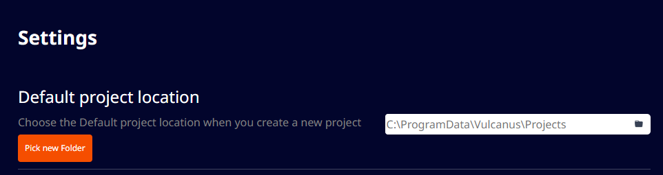
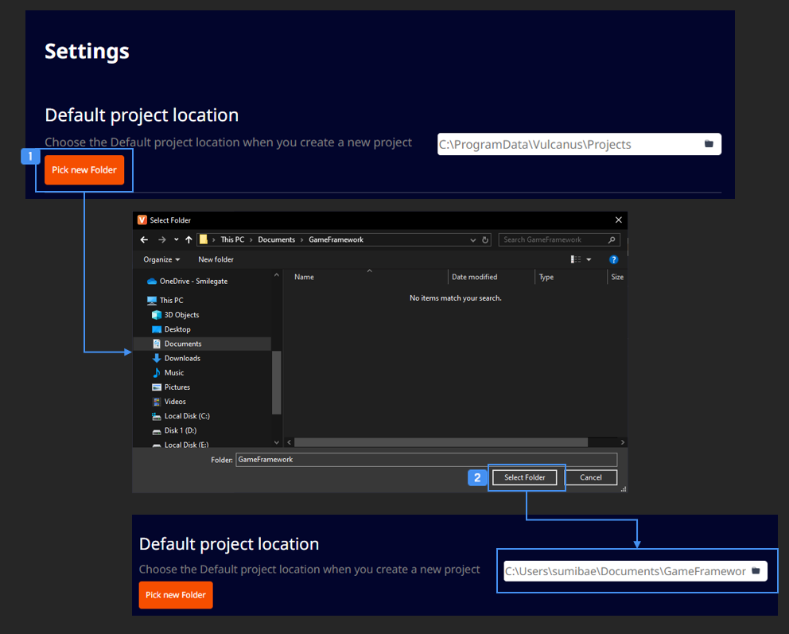

# 프로젝트 위치

 {width="900"}

컴패니언 앱의 Settings 메뉴에서 프로젝트가 생성되는 위치를 확인할 수 있습니다.

## 프로젝트 생성 위치 변경

 {width="900"}

 'Pick New Folder' 버튼을 클릭하면 새로 생성되는 프로젝트의 생성 폴더를 지정할 수 있습니다.  

- 기존에 생성한 프로젝트는 이동되지 않습니다.  

 변경할 경로를 선택하고 'Select Folder' 버튼을 클릭하면 경로가 변경됩니다. 새롭게 생성하는 프로젝트는 변경된 경로에 생성됩니다.