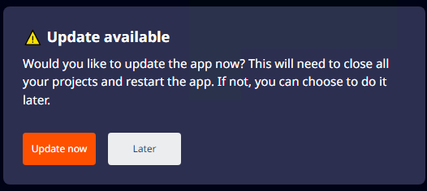
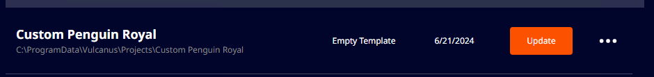

# 앱 업데이트

불카누스 컴패니언 앱은 항상 최신 버전으로 유지되며, 최신 버전이 아닌 경우엔 업데이트 후에 정상적으로 기능을 사용할 수 있습니다.  
불카누스 컴패니언 앱은 다음의 경우에 새 버전을 체크합니다.

1. 앱을 실행한 경우
2. 시스템 트레이로 최소화한 상태에서 창을 열 경우  
3. 앱이 실행 중인 상태에서 Settings의 'Check for Update' 버튼을 클릭한 후 업데이트 체크

1, 2의 경우 자동으로 새 버전으로 업데이트 되며 업데이트가 완료되면 새 버전으로 앱이 실행됩니다.  
3의 경우 새로운 버전이 확인되면 업데이트 여부를 선택할 수 있는 팝업이 출력됩니다.

컴패니언 앱 업데이트는 다음의 내용을 포함합니다. 아래의 항목 중 한 가지라도 상위 버전이 확인되면, 컴패니언 앱을 업데이트 할 수 있습니다.
- 불카누스 컴패니언 앱
- 불카누스 패키지  

## 자동 업데이트

컴패니언 앱을 실행하는 경우 자동으로 업데이트가 진행됩니다.

## 수동 업데이트

 {width="400"}

Settings 메뉴에서 App Version의 'Check for Update'로 새 버전을 체크한 후, 업데이트가 필요하면 팝업이 출력됩니다.  
이 때 업데이트 진행 여부를 선택할 수 있습니다.

### 'Update now'버튼을 클릭하면,

현재 실행 중인 컴패니언 앱과 에디터를 종료한 후 새 버전의 컴패니언 앱를 다운로드합니다.  
다운로드가 완료되면 설치가 진행되고, 완료되면 새 버전의 컴패니언 앱이 실행됩니다.  

### 'Later' 버튼을 클릭하면,

1. 컴패니언 앱 재시작/실행 또는 업데이트를 진행할 때까지 다음의 영역에 레드닷 알림이 표시됩니다.
   - Settings 메뉴
   - Updates 버튼 (Check for Updates 버튼이 'Update'로 변경됩니다.)  

2. 다음의 경우에 컴패니언 앱이 종료되고 업데이트를 진행합니다.
   - 종료 후 재시작
   - 창닫기 후 (시스템트레이로 축소) 시스템트레이에서 컴패니언 앱를 다시 열었을 때

## 프로젝트 패키지 업데이트

컴패니언 앱을 새 버전으로 업데이트하면 불카누스 패키지도 함께 업데이트 됩니다.  
때문에 기존에 생성된 프로젝트에 적용된 불카누스 패키지도 업데이트해야 프로젝트를 이어서 편집할 수 있습니다.  
기존 프로젝트의 패키지는 사용자가 원하는 때에 업데이트할 수 있습니다.   
프로젝트에 적용된 불카누스 패키지는 항상 최신 버전을 유지해야합니다.  

- 패키지가 최신 버전이 아닐 경우 프로젝트 리스트의 'Open'버튼은 'Update' 버튼으로 변경됩니다.

   {width="900"}

- 'Update' 버튼을 클릭하면 최신 버전의 패키지로 업데이트되며, 패키지 업데이트가 완료되면 불카누스가 자동 실행 됩니다.