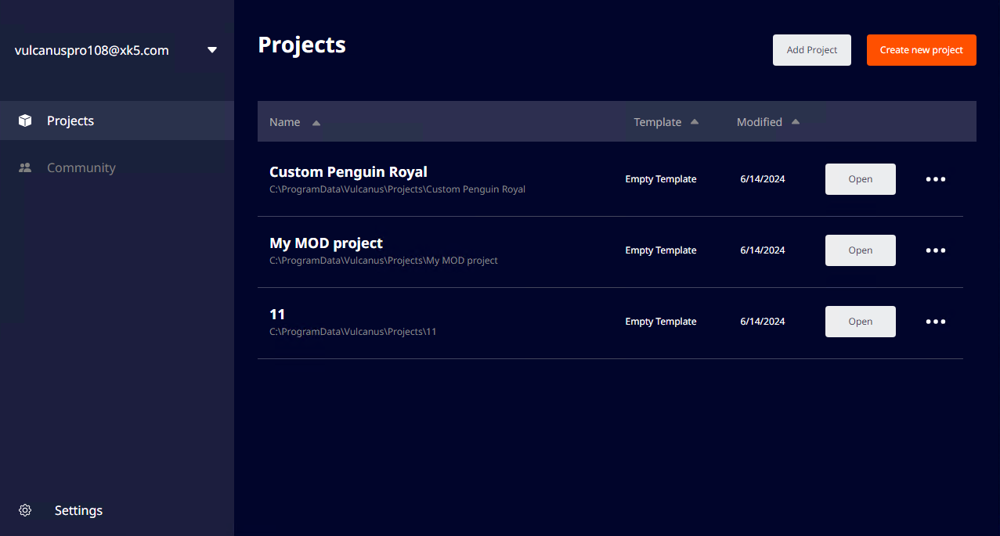

# 불카누스 컴패니언 앱

불카누스 컴패니언 앱은 불카누스 설치, 불카누스 프로젝트 생성, 관리가 가능한 Windows용 application 입니다.

 {width="900"}

## 설치 

불카누스 컴패니언 앱은 기본적으로 "%LOCALAPPDATA%\Programs" 경로에 설치됩니다. (예: C:\Users\UserName\AppData\Local\Programs)  
다운로드 한 불카누스 컴패니언 앱 설치 파일을 실행하면 컴패니언 앱이 PC에 자동으로 설치됩니다.  
설치가 완료되면 컴패니언 앱이 바로 실행됩니다.

## 기능

1. **XK5 로그인:** 불카누스 컴패니언 앱은 XK5 계정으로 로그인해야만 사용할 수 있습니다.  
2. **게임 프레임워크 프로젝트 생성 및 관리:** 게임 프레임워크 템플릿을 통해 불카누스 전용 게임 프로젝트를 생성하고 관리할 수 있습니다.
3. **컴패니언 앱 업데이트:** 컴패니언 앱이 업데이트될 경우 자동 또는 수동으로 확인하고 업데이트할 수 있습니다.
4. **게임 프레임워크관련 패키지 업데이트:** 템플릿 및 패키지 등 게임 프레임워크관련 내용이 업데이트 될 경우 자동 또는 수동으로 확인하고 업데이트할 수 있습니다.

## 요구사양

### 플랫폼

- **지원 플랫폼:** 앱을 설치할 수 있는 플랫폼 목록입니다.
  - Windows 10 및 Windows 11(64비트 x64만 해당)

- **최소 시스템 요구 사항:** 하드웨어 및 소프트웨어 요구 사항.  
  - **OS:** Windows 10(64비트) 이상  
  - **CPU:** Intel Core i5 또는 AMD Ryzen 3 1200  
  - **RAM:** 8GB (복잡한 프로젝트의 경우 16GB 권장)  
  - **그래픽:** DX10(셰이더 모델 4.0) 기능이 있는 그래픽 카드 이상  
  - **저장공간:** 20GB 사용 가능 공간  
  - **추가:** .NET Framework 4.8, ASPNET Core 6.0, 인터넷 연결  

- **에디터 요구 사양:** 불카누스에디터는 Unity 2021.3.38f1 버전을 사용합니다. Unity 2021 LTS 버전의 시스템 요구 사양은 다음의 링크를 참고해 주십시요.
  - [Unity 에디터 설치 요구 사양](https://docs.unity3d.com/2021.3/Documentation/Manual/system-requirements.html)

## 불카누스 컴패니언 앱 메뉴
<toc/>