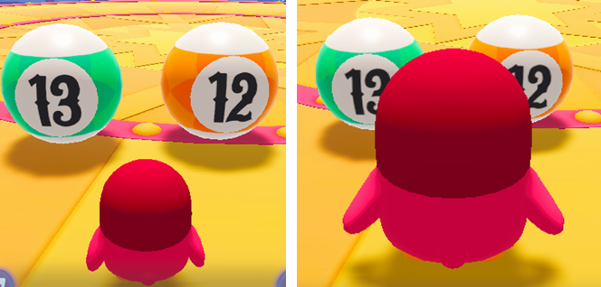

# 거대화

이름 : B_MushRoom

  {width="400"}

게임 내에서 캐릭터 버프를 제공할 경우에 사용하는 장치입니다.  
버프가 실행되면 캐릭터의 크기를 크게 변경합니다.  
변경된 캐릭터의 크기에 따라 캐릭터의 힘의 영향이 자동 반영 됩니다.

## 옵션

1. 버프 장치는 별도의 옵션을 제공하지 않습니다.  
2. 장치를 커스텀 장치로 만들고, Visual Script를 통해 직접 데이터를 수정해야 합니다.

## 기능

1. 버프 장치는 캐릭터와 연관되어 사용되기 때문에 별도의 이벤트 연결 기능을 제공하지 않습니다.

## 이벤트
1. 버프 장치를 사용했을 시 별도의 이벤트를 제공하지 않습니다.

## Tip
1. 별도의 장치(커스텀 장치)와 연결하여 버프 효과를 즉시 적용할 수 있습니다.
2. 위와 같은 방법으로 게임 중간에 버프 효과를 제공하는 기믹을 직접 개발할 수 있습니다. 

## 참고

- [기믹 장치](Gimmick-toc.md)
- [비주얼 스크립팅](Visual-Scripting.md)
- [장치간 이벤트 연결하기](Connect-Event-Between-Devices.md)