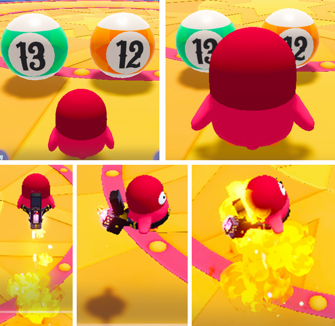
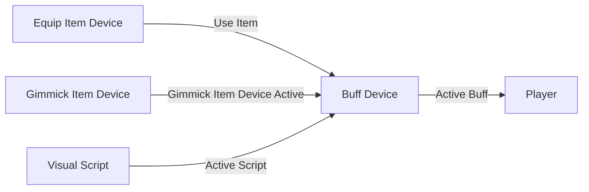
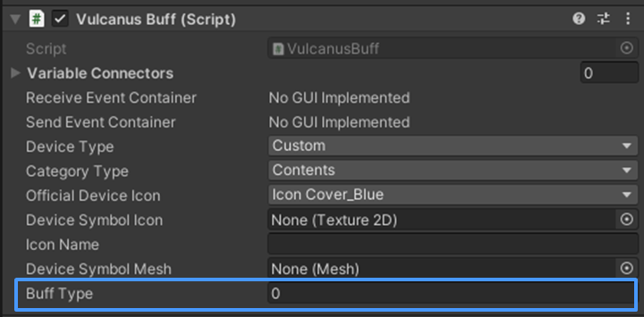

# 버프 장치

 {width="400"}

버프 장치는 '비주얼 스크립트' 혹은 '장착 아이템'과 연계하여 사용하는 장치입니다.  
장착 아이템 장치를 사용하면, 장착 아이템 장치와 연결된 버프 장치가 실행되며, 버프 효과가 캐릭터에 적용됩니다.

## 주요 특징

- Hierarchy 또는 팔레트에서 새 버프 장치를 생성할 수 있습니다.
- 새롭게 제작한 버프 장치는 Buff Type만 설정할 수 있습니다.
- 버프 장치 Type 구성
  - **Index 0:** 거대화 버프
  - **Index 1:** 날기 버프
- 버프 장치는 다양한 상황에서 사용할 수 있습니다.
- 버프 장치를 '장착 아이템', '기믹 아이템', '직접 구성한 비주얼 스크립트'와 연계하여 사용할 수 있습니다

## 옵션

{width="400"}

**Buff Type:** 사용할 버프의 타입 값을 설정합니다. 

## 버프 장치 종류

<toc/>