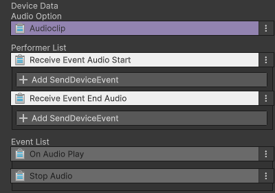

# 오디오 장치

이름: CD_Audio

 {width="400"}

Audio 장치는 이벤트를 받았을 때 설정한 Audio를 켜거나 종료합니다.

## 옵션

{width="400"}

| **이벤트 이름** | **내용**                | 
|------------|-----------------------|
| Audio Clip | 사용할 Audio Clip을 연결합니다 |

## 기능

| **이벤트 이름**                         | **내용**                    | 
|------------------------------------|---------------------------|
| Receive Event Start Audio          | 이벤트를 받으면 설정한 오디오를 실행합니다.  |
| Receive Event End Audio            | 이벤트를 받으면 실행 중인 오디오를 종료합니다 |

## 이벤트

| **이벤트 이름**    | **내용**                       | 
|---------------|------------------------------|
| On Audio Play | 오디오가 실행되면 연결된 장치는 트리거를 실행합니다 |
| Stop Audio    | 오디오가 종료되면 연결된 장치는 트리거를 실행합니다 |

## 참고

- [비주얼 스크립팅](Visual-Scripting.md)
- [장치간 이벤트 연결하기](Connect-Event-Between-Devices.md)
- [Instruction](Instruction.md)