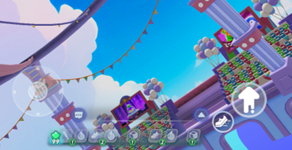
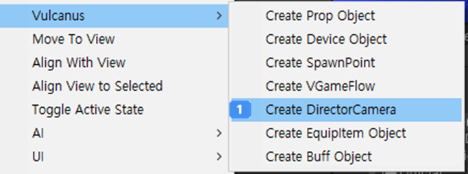
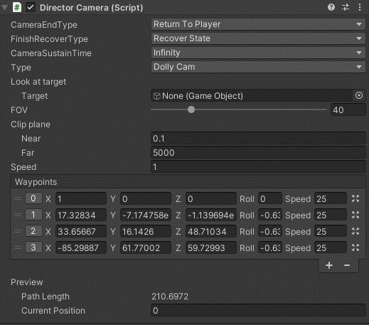

# 연출 카메라 장치

이름 : CD_Camera

{width="400"}

연출 카메라 장치는 게임의 시작 혹은 중간에 카메라 연출을 설정할 수 있는 장치입니다. 
설정하는 카메라 타입에 따라 자유롭게 사용할 수 있습니다. 

## 주요 특징
연출 카메라 장치는 카메라 연출 기능에 대한 옵션을 구성되어 있습니다. 
1. 장치를 여러개 설치할 수 있습니다.
2. 팔레트에서 추가하거나 컨텍스트 메뉴를 통해 장치를 추가할 수 있습니다.

### Hierarchy에서 컨텍스트 메뉴로 추가하는 방법

{width="400"}

생성 시 Hierarchy에 'Direction Camera'이름으로 생성됩니다.

## 옵션
{width="400"}

| 이름                  | 설명                                                                |
|:--------------------|:------------------------------------------------------------------|
| Camera End Type     | 카메라가 종료될 때 전환되는 위치를 설정할 수 있습니다.                                   |
|                     | - Return to Camera : 카메라 연출이 종료되면 플레이어 인게임 카메라로 전환됩니다.            |
|                     | - Return to Anothor Camera : 카메라 연출이 종료되면 연결된 다른 카메라로 전환됩니다.      |
| Finish Recover Type | 연출이 끝났을 때 카메라의 상태를 설정한다.                                          |
|                     | - KeepState : 연출이 끝나면 카메라 초기 상태로 돌아간다. (카메라 설정 값이 연출 시작 전으로 돌아간다) |
|                     | - RecoverState : 연출이 끝나면 끝난 위치에 유지한다                              |
| Camera Sustain Time | 카메라가 끝났을 때 유지 조건을 설정한다.                                           |
|                     | - infinity : 추가 이벤트가 없는 한 현재 카메라를 황성 상태로 유지한다.                    |
|                     | - ByCameraPath : 카메라에 연출된 경로(Path)의 끝에 도달하면 카메라를 비활성으로 전환한다       |
|                     | - Value : 지정된 시간이 되면 비활성 상태로 전환한다                                 |
| Type                | 카메라 타입을 설정한다                                                      |
|                     | - Fixed Cam : 고정 카메라 타입으로 사용한다                                    |
|                     | - Dolly Cam : 설정한 경로에 따라 카메라를 이동한다                                |
| Look at Target      | 카메라가 주시하는 대상을 설정한다                                                |
| Fov                 | Camera의 Fov 값을 설정한다                                               |
| Clip plane          | 카메라의 Clipping 거리를 설정한다                                            |
|                     | - Near : 카메라와 화면에 보이는 오브젝트 사이의 최소 거리를 설정한다                        |
|                     | - Far : 카메라와 화면에 보이는 오브젝트 사이의 최대 거리를 설정한다                         |
| Speed               | 카메라 Path를 사용할 때의 속도를 설정합니다                                        |
| Preview             | Dolly 카메라를 사용할 때 카메라의 이동을 미리볼 수 있습니다.                             |
|                     | - Path Length : Path 사용시 길이를 표시합니다                                |
|                     | - Current Position : 카메라 Path 이동 시 현재 위치한 값을 표시합니다.               |

## Tip
1. 카메라 장치는 Visual Script를 이용하여 카메라를 활성할 수 있습니다.
2. Scene에 배치된 카메라를 대상으로 Visual Script를 사용할 수 있습니다.
   

## 참고
 
- [비주얼 스크립팅](Visual-Scripting.md)
- [Instruction](Instruction.md)

