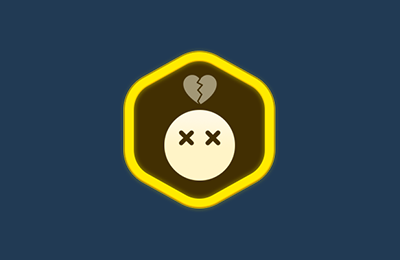

# 사망 존 장치

이름 : CD_DeathZone

 {width="400"}

캐릭터가 지정된 위치에 닿으면, 플레이어의 Life를 감소하고 지정된 위치에 스폰 시키는 장치입니다.
- 사망 장치는 모형(Mesh)를 가지고 있지 않습니다.
- Box collider와 Visual Script로 구성되어 있기 때문에 다른 장치와 연결하여 다양하게 사용할 수 있습니다.

## 옵션

 {width="400"}

| **이름**        | **내용**                                    |
|:--------------|:------------------------------------------|
| Size          | 사망 영역의 크기를 설정할 수 있습니다.                   |
| Life Value    | 사망 시 감소할 Life 개수를 설정할 수 있습니다.|
| Respawn Point | 사망 시 리스폰 할 스폰 장치를 연결할 수 있습니다.            |

## 기능
사망 장치는 이벤트를 받아 작동하는 기능을 제공하지 않습니다.

## 이벤트

| **이벤트 이름**            | 내용                                    | 
|:----------------------|:--------------------------------------|
| Player Spectate Enter | 플레이어가 관전 상태로 진입하면 연결된 장치는 트리거를 실행합니다. |
| On Player Respawn     | 플레이어가 리스폰 되면 연결된 장치는 트리거를 실행합니다.      |

## 참고

- [비주얼 스크립팅](Visual-Scripting.md)
- [장치간 이벤트 연결하기](Connect-Event-Between-Devices.md)
- [Instruction](Instruction.md)
