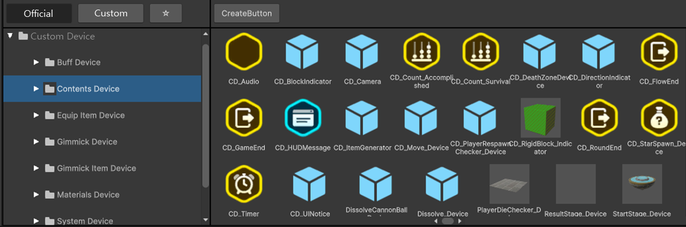

# 컨텐츠 장치

 {width="900"}

컨텐츠 장치는 장치의 한 종류이며, Visual Script로 구성되어 있습니다.
사용자는 컨텐츠 장치를 다음과 같은 용도로 사용할 수 있습니다.
- 컨텐츠 장치는 Visual Script를 이용하여 개발된 장치입니다.
- 사용자는 컨텐츠 장치를 복제하여 나만의 커스텀 장치로 커스텀 할 수 있습니다.
  - 커스텀 장치는 장치의 내부 구조를 확인할 수 있습니다.
- 컨텐츠 장치에 제공된 기즈모를 이용하여, 제작 중인 Scene에서만 장치를 표시할 수 있습니다. 

## 컨텐츠 장치 동작 Flow
 1. 컨텐츠 장치는 장치에 작성된 Trigger를 실행하여 장치 Script를 실행합니다.  
 2. Trigger 이벤트를 받는 위치는 아래와 같습니다.
     - 플로우 장치 : 플로우 장치에서 보낸 이벤트 메시지를 트리거로 이용합니다.
     - Scene에 배치된 다른 장치 : 기믹과 다른 컨텐츠 장치에서 보낸 메시지를 트리거로 이용합니다

## 팔레트에서 공식 컨텐츠 장치 찾기

 {width="900"}
팔레트 경로 : 팔레트 > 공식 탭 > Contents Device 폴더

## 컨텐츠 장치 위치

PaletteResource 윈도우 > Official 탭 > Device > 'Contents Device'

## 컨텐츠 장치 종류

불카누스 에디터에는 다양한 컨텐츠 장치가 있습니다.
자세한 내용은 하단의 컨텐츠 장치를 참조 바랍니다.

<toc/>