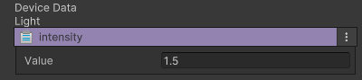

# 환경 설정 장치

이름: CD_Environment

 {width="400"}

게임의 환경 (Skybox, fog, Directional Light, Volume)을 설정하는 장치입니다.

## 옵션
환경 설정은 4개의 주요 기능을 관리합니다.
1. Skybox 설정

| **이름**                 | **내용**                                                          |
|:-----------------------|:----------------------------------------------------------------|
| sky Box Material       | Scene에서 사용할 Skybox Material을 설정합니다.                             |
| Real Time Shadow Color | 그림자 색상을 설정합니다                                                   |
| Environment lighting   | 환경에 사용하는 Light 타입과 값을 설정합니다.                                    |
|                        | - Source : Lighting Source 타입을 설정합니다. (Skybox, Gradient, Color) |
|                        | - Source Type을 설정하면 관련 세부 옵션이 추가됩니다.                         |

2. Fog 설정

| **이름**                 | **내용**                                                            |
|:-----------------------|:------------------------------------------------------------------|
| Fog 사용 여부              | 체크박스를 통해 Fog의 사용 여부를 설정합니다                                        |
|  | - Color : fog Color를 설정합니다                                        |
|  | - Mode : fog의 Mode(Liner, Exponential, Exponential Squere)를 설정합니다 |
|  | - Mode를 선택하면, 관련 세부 옵션이 추가됩니다                                     |

3. Directional Light

 {width="400"}

| **이름**     | **내용**           |
|:-----------|:-----------------|
| intensity  | Light의 밝기를 설정합니다 |

4. 옵션은 없지만 환경 설정에는 "Volume"기능이 포함되어 있습니다.

## Tip
1. 환경 설정 장치는 1개만 배치하여 사용할 수 있습니다.
2. 환경 설정 장치는 Unity의 글로벌 환경 설정과 연동됩니다.