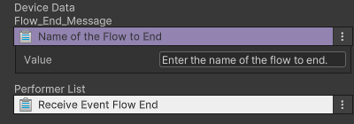

# 게임 종료 장치

게임 종료와 관련된 장치는 3개로 구성되어 있습니다.  

플로우 종료 장치: CD_Flow_End  
라운드 종료 장치: CD_Round_End  
게임 종료 장치: CD_Game_End  

{width="400"}

게임이 진행하는 중에 플로우 종료 여부 관계 없이 게임 혹은 플로우를 종료할 수 있는 컨텐츠 장치입니다.  

## 옵션

{width="400"}

| **이름**                  | **내용**                            |
|-------------------------|-----------------------------------|
| Name of the Flow to End | 플로우 장치가 실행될 때, 종료할 플로우 이름을 설정합니다. |

## Tip
1. 트리거가 실행되면, 플로우를 종료하기 위한 이벤트를 플로우 장치에 전송합니다.
   - 플로우를 종료하기 위해 설정한 메시지가 반드시 플로우 장치의 플로우 이름이 등록되어 있어야 합니다.
   - 설정한 메시지와 플로우 이름과 동일하지 않거나, 플로우 장치에 입력한 내용이 없을 경우 해당 이벤트는 무시합니다. 
2. 라운드 종료와 게임 종료의 차이
   - 라운드 종료 장치 : 트리거가 실행되면, 남은 라운드 관계 없이 진행 중인 게임을 종료하며 게임 결과창으로 이동합니다.
   - 게임 종료 장치 : 트리거가 실행되면, 현재 진행 중인 라운드를 종료합니다.

## 기능

| **이벤트 이름**              | 사용 장치     | 내용                                | 
|-------------------------|-----------|-----------------------------------|
| Receive Event Flow End  | 플로우 종료 장치 | 이벤트를 받으면 설정된 플로우를 종료합니다.          |
| Receive Event Round End | 라운드 종료 장치 | 이벤트를 받으면 라운드를 종료하고, 게임 결과로 이동합니다. |
| Receive Event Game End  | 게임 종료 장치  | 이벤트를 받으면 현재 스테이지를 종료합니다.          |

## 이벤트

- 게임 종료 장치들은 Send Event Message를 제공하지 않습니다.

## 참고
게임 종료와 관련된 장치를 다양하게 사용하기 위해서는 하단의 기능을 참고하세요
- [비주얼 스크립팅](Visual-Scripting.md)
- [장치간 이벤트 연결하기](Connect-Event-Between-Devices.md)
- [시스템 Flow 장치](System-Flow.md)