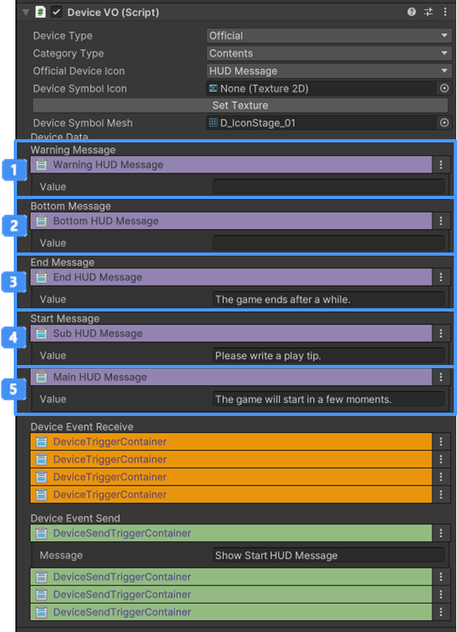

# HUD 메세지 장치

{width="400"}

이벤트를 받았을 때 특정 혹은 모든 플레이어에게 입력한 메시지를 표시합니다.

## 이름

CD_HUDMessage

## 옵션

{width="400"}

| **이름**                                                                   | **내용**                                           |
|:-------------------------------------------------------------------------|:-------------------------------------------------|
|  경고 메시지          | 게임에 표시할 경고 알림 메시지를 설정합니다                         |
|  하단 메시지          | 게임에 표시할 하단 메시지를 설정합니다                            |
|  게임 종료 안내 메시지    | 게임을 종료하거나, 종료 알림을 표시할 메시지를 설정합니다                 |
|  시작 시 출력할 서브 메시지 | 게임을 시작하거나, 시작 알림을 표시할 메인 메시지 메시지를 설정합니다          |
|  시작 시 출력할 서브 메시지 | 게임을 시작하거나, 시작 알림을 표시할 서브 메시지(Tooltip) 메시지를 설정합니다 |

## 기능

| **이벤트 이름**                         | 내용                | 
|------------------------------------|-------------------|
| Receive Event Start HUD Message    | 이벤트를 받으면 게임 시작 메시지(메인, 서브)를 출력합니다.|
| Receive Event Event HUD Message    | 이벤트를 받으면 게임 종료 메시지를 출력합니다|
| Receive Event Start Bottom Message | 이벤트를 받으면 경고 메시지를 출력합니다|
| Receive Event Warning HUD Message  | 이벤트를 받으면 하단 알림 메시지를 출력합니다.|

## 이벤트

| **이벤트 이름** | 내용                | 
|-------------------|-------------------|
| Show Start HUD Message          | 시작 메시지가 HUD에 표시되었을 때 연결된 장치는 트리거를 실행합니다 |
| Show End HUD Message | 종료 메시지가 HUD에 표시되었을 때 연결된 장치는 트리거를 실행합니다 |
| Show Bottom HUD Message | 하단 메시지가 HUD에 표시되었을 때 연결된 장치는 트리거를 실행합니다 |
| Show Warning HUD Message | 경고 메시지가 HUD에 표시되었을 때 연결된 장치는 트리거를 실행합니다 |

## 참고

- [비주얼 스크립팅](Visual-Scripting.md) 
- [장치간 이벤트 연결하기](Connect-Event-Between-Devices.md)
- [Instruction](Instruction.md)

