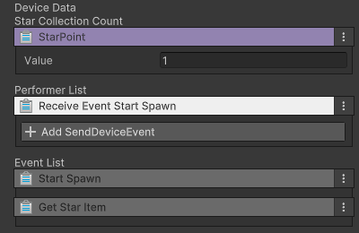

# 별 크래프트 스폰 장치

이름: CD_StartSpawn_Device

 {width="400"}

이벤트를 받았을 때 게임 상에 별 크래프트 아이템을 스폰하는 장치입니다.

## 옵션

 {width="400"}

| 이름                                                                         | 설명                         |
|:---------------------------------------------------------------------------|:---------------------------|
| Star Collection Count | 스폰된 별을 획득 시 지급할 개수를 설정합니다. |

##  기능

| **이벤트 이름**               | 내용                    | 
|--------------------------|-----------------------|
| Receive Event Star Spawn | 이벤트를 받으면 별 스폰을 시작합니다. |

## 이벤트

| **이벤트 이름** | 내용                                    | 
|-------------------|---------------------------------------|
| Start Spawn | 게임에서 별이 스폰되면, 연결된 장치는 트리거를 실행합니다.     |
| Get Star Item | 스폰된 별을 플레이어가 획득하면, 연결된 장치는 트리거를 실행합니다 |

## 참고

- [비주얼 스크립팅](Visual-Scripting.md)
- [장치간 이벤트 연결하기](Connect-Event-Between-Devices.md)
- [Instruction](Instruction.md)