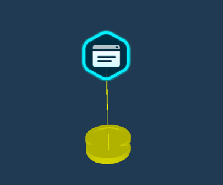
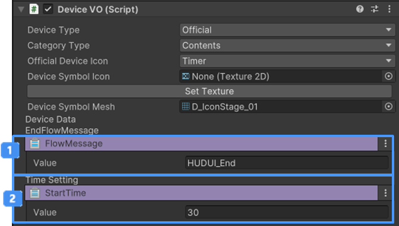

# 타이머 장치

{width="400"}

이벤트를 받았을 게임 중앙에 표시되는 메인 타임을 변경할 수 있습니다.

## 이름

CD_Timer

## 옵션

{width="400"}

| 메뉴                                                                    | 설명                                             |
|:----------------------------------------------------------------------|:-----------------------------------------------|
|   메인 타임 UI 끄기 | Flow 장치에 입력된 이벤트 메시지를 이용하여 메인 타임 UI를 끌 수 있습니다. |
|  시간 설정        | 타이머가 진행하는 시간을 설정합니다.                           |

## 기능
장치간 연결된 이벤트를 받아 타이머를 실행할 수 있습니다.

## 이벤트
TimeStart: 타이머가 시작되면 연결된 장치는 트리거를 실행합니다

## 참고

- [비주얼 스크립팅](Visual-Scripting.md)
- [장치간 이벤트 연결하기](Connect-Event-Between-Devices.md)