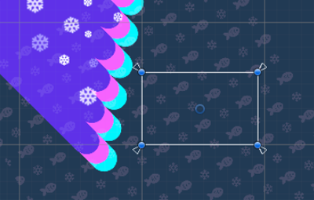
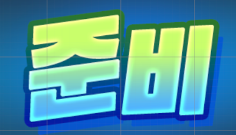
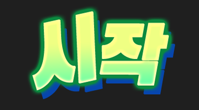
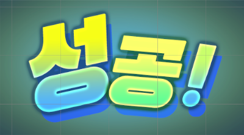

# 연출 UI 출력 장치

{width="400"}

제작된 UI 연출 프리펩을 출력 시켜주는 장치.
- 각 연출을 출력하는 이벤트를 각각 설정할 수 있으며 연출 내부에 관여할 수 있는 옵션은 제공하지 않습니다.
- 연출 UI의 개수만큼 이벤트 설정 UI가 제공되나 현재는 각각의 연출의 목록이 UI에 표시되지 않고 있습니다. (이 부분은 차주에 수정 예정으로 동일해 보이는 이벤트 설정 UI의 순서를 아래 장치 옵션의 순서로 참고 해 주세요)

## 이름

CD_DirectedUI

## 옵션

별도의 장치 옵션이 존재하지 않습니다.

## 기능

| **UI**        |                            **이미지**                             | **내용**                                           |
|:--------------|:--------------------------------------------------------------:|:-------------------------------------------------|
| 화면 전환         |            | UI가 전체 화면을 가려주어 카메라 연출 등을 설정한 후 화면을 전환할 때 사용합니다. |
| 준비 효과         |                      | 준비 연출을 출력 합니다.                                   |
| 카운트 다운        |              | 5,4,3,2,1 로 이어지는 숫자 카운트다운 연출을 출력합니다.             |
| 시작 효과         |                      | 시작 연출을 출력합니다.                                    |
| 라운드 종료 효과     |                          | 일반적인 라운드 종료 효과를 출력합니다.                           |
| 종료 효과         |                          | 종료 효과를 출력합니다.                                    |
| 마지막 라운드 종료 효과 |  | 가장 화려한 종료 효과를 출력합니다.                             |
| 성공 효과         |                  | 성공 연출을 출력합니다.                                    |
| 실패 효과         |                        | 실패 연출을 출력합니다.                                    |

## 이벤트

- On Called Transition UI
- On Called Ready UI 
- On Called CountDown UI
- On Called Start UI
- On Called Round End UI
- On Called Phase End UI
- On Called Final Round End UI
- On Called Success UI
- On Called Fail UI