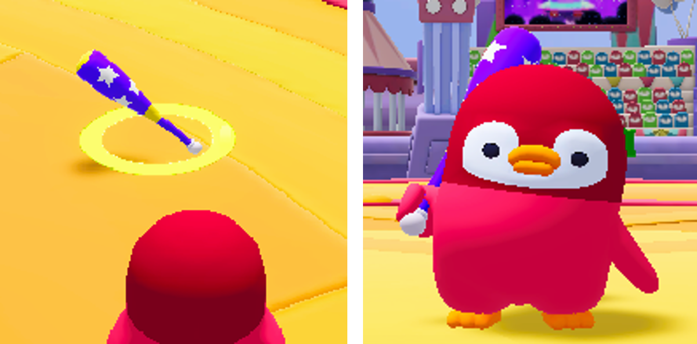
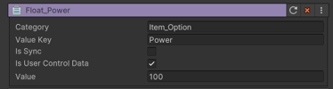

# 방망이 장치

이름 : ItemE_Bat

 {width='400'}

게임 내에서 캐릭터가 장착하고 사용할 수 있는 아이템 중 하나입니다.  
아이템 사용 시 유저 혹은 게임 오브젝트와의 상호 작용을 통해 게임을 진행할 수 있습니다.

## 방망이 장치 주요 특징
1. 아이템을 사용하면 피격 당한 플레이어 혹은 오브젝트에게 일정 거리만큼 밀어(넉백)냅니다.
2. 별 크래프트를 통해 구매가 가능합니다.
3. 아이템을 획득하면 캐릭터 애니메이션 (Idle, Run, Attack)이 변경됩니다.

## 옵션
 {width="400"}

| **이름**                                                   | **내용**                           |
|:--------------------------------------------------|:---------------------------------|
|  Power    | 넉백 시 밀쳐내는 값을 설정 합니다           |

## 기능
1. 장착 아이템 장치는 이벤트를 수신 받아 작동하지 않습니다.

## 이벤트
1. 장착 아이템 장치을 사용했을 시 별도의 이벤트를 제공하지 않습니다.

## 참고

- [버프 장치](Buff-System.md)
- [Instruction](Instruction.md)