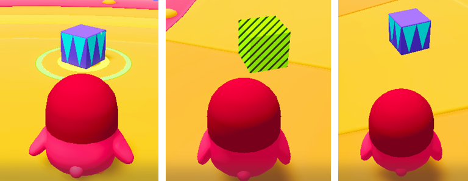

# 블록 장치

이름 : ItemE_BlockItem 

{width="400"}

게임 내에서 캐릭터가 장착하고 사용할 수 있는 아이템 중 하나입니다.  
아이템 사용 시 유저 혹은 게임 오브젝트와의 상호 작용을 통해 게임을 진행할 수 있습니다.

## 블록 아이템 장치 주요 특징
1. 아이템을 사용하면 기믹 아이템(블록)이 생성됩니다.
2. 생성된 블록은 플레이어를 보호하는 장애물 역할을 할 수 있습니다.
3. HUD UI 버튼을 누르고 있으면 블록을 설치하는 Indicator가 생성되며 해당 위치에 블록을 생성할 수 있습니다
4. 별 크래프트를 통해 구매가 가능합니다.
5. 폭탄 및 방망이와 같은 아이템과 동시에 사용할 수 있습니다.

## 옵션
1. 별도의 옵션을 제공하지 않습니다.

## 기능
1. 장착 아이템 장치는 이벤트를 수신 받아 작동하지 않습니다.

## 이벤트
1. 장착 아이템 장치을 사용했을 시 별도의 이벤트를 제공하지 않습니다.

## 참고

- [버프 장치](Buff-System.md)
- [Instruction](Instruction.md)