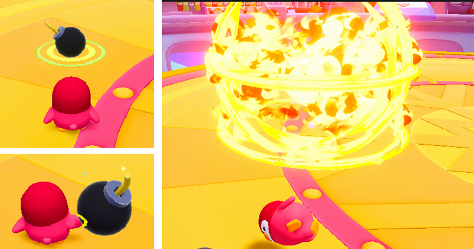
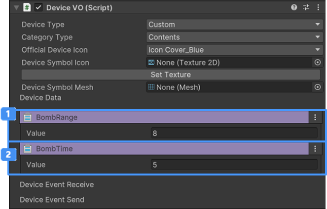

# 폭탄 장치

이름 : ItemE_Bomb

 {width="400"}

게임 내에서 캐릭터가 장착하고 사용할 수 있는 아이템 중 하나입니다.  
아이템 사용 시 유저 혹은 게임 오브젝트와의 상호 작용을 통해 게임을 진행할 수 있습니다.

## 폭탄 아이템 장치 주요 특징
1. 아이템을 사용하면 기믹 아이템(폭탄)이 생성됩니다.
2. 일정 시간이 지나면 폭탄이 폭발하고, 반경 내에 있는 모든 오브젝트(폭탄 설치자 포함)를 일정 거리 밀쳐냅니다.
3. 별 크래프트를 통해 구매가 가능합니다.
4. 폭탄 아이템은 아이템을 생성하는 기믹 아이템에서 설정할 수 있습니다.

## 옵션
{width="400"}

| **이름**                                                             | **내용**               |
|:-------------------------------------------------------------------|:---------------------|
|  BombRange | 아이템 폭발 범위를 설정합니다.    |
|  Bombtime  | 아이템이 폭발하는 시간을 설정합니다. |

## 기능
1. 장착 아이템 장치는 이벤트를 수신 받아 작동하지 않습니다.

## 이벤트
1. 장착 아이템 장치을 사용했을 시 별도의 이벤트를 제공하지 않습니다.

## Tip
1. 커스텀 장치로 변환하고, 장치 내부에서 생성되는 아이템을 변경할 수 있습니다.

## 참고

- [버프 장치](Buff-System.md)
- [Instruction](Instruction.md)