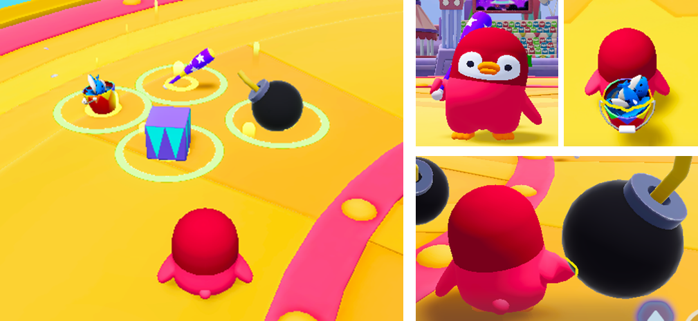
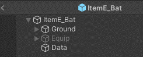
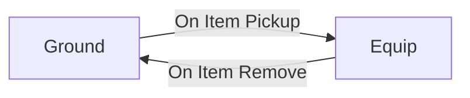
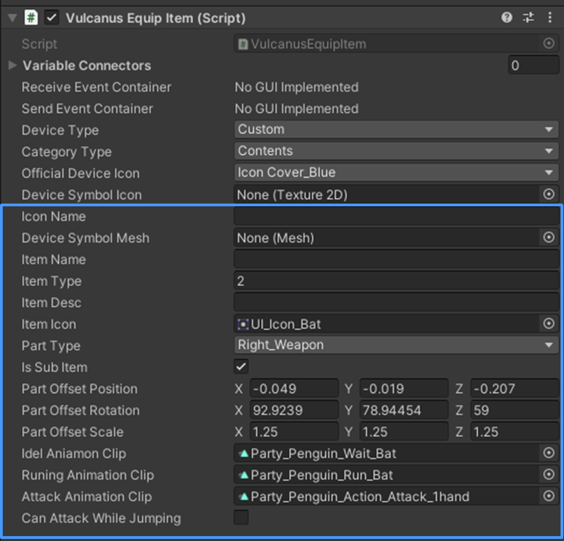
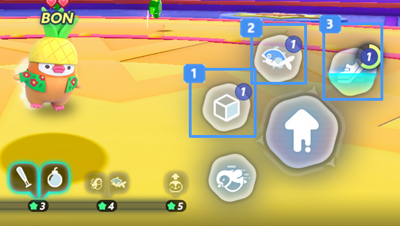
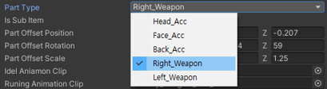

# 장착 아이템 장치

{width="900"}

장착 아이템은 별 크래프트 혹은 Stage에 직접 등장 시키고 플레이어가 획득하여 사용할 수 있습니다.  
캐릭터가 아이템을 획득했을 때, 아이템을 캐릭터에 착용하고, 착용한 아이템을 사용할 수 있습니다.

## 장착 아이템 장치 특징

장착 아이템 장치의 Property를 이용하여 아이템이 붙는 위치(Position)을 설정할 수 있습니다.  
장착 아이템을 획득하면, 지정된 HUD Button에 등록됩니다.  
장착 아이템은 동일한 HUD Button을 기준으로 1개 타입의 아이템만 획득할 수 있으며, 아이템 소지 중에 다른 아이템을 획득할 경우 기존의 아이템이 삭제됩니다.  
장착 아이템은 버프 장치 혹은 기믹 아이템 장치와 연계하여 아이템 제작을 완성할 수 있습니다.  

## 장치 사용법

### 생성

장착 아이템은 Hierarchy 혹은 팔레트에서 새 장착 아이템 장치를 생성할 수 있습니다.
   - 생성한 장치의 내부를 확인할 수 있으며, 장착 아이템 장치 내부는 Ground와 Equip의 영역으로 구성되어 있습니다.
   
 {width="400"}

#### 'Ground'와 'Equip'의 구조
   

- Ground : 드롭된 아이템을 플레이어가 획득하기 위한 Script로 구성되어 있습니다.
- Equip : 캐릭터가 아이템을 착용하고, 아이템을 사용 효과에 대한 Script로 구성되어 있습니다.

### 설정

장착 아이템 장치는 장착과 관련된 Property를 제공합니다

{width="400"}

1. **Item Name:** 아이템의 이름을 설정합니다.
2. **Item Type:** 아이템 타입을 설정합니다.
   - 아이템 타입은 아이템을 획득 했을 때 배치될 HUD Button 위치를 지정합니다.
   - 번호는 0~2번의 index 값을 사용하며, 값에 따라 HUD Button이 고정되어 표시됩니다.  
   - 버튼의 위치는 다음과 같습니다.

    {width="400"}

     HUD Button 2번에 위치하며, index 0번으로 관리됩니다.  
     HUD Button 3번에 위치하며, index 1번으로 관리됩니다.  
     HUD Button 4번에 위치하며, index 2번으로 관리됩니다.  

3. **Item Description:** 아이템의 설명 문구를 입력할 수 있습니다
4. **Item Icon:** HUD Button에 표시할 아이콘을 설정합니다.
5. **Parts Type:** 아이템이 붙을 파츠를 선택합니다. **(Parts Type Proerty 아래의 항목은 아이템을 캐릭터에 붙이기 위한 기능입니다)**
   - Parts Type은 5개로 구성되어 있습니다.
    
    {width="400"}
    
   - Head_Acc : 머리 악세사리 파츠 위치에 아이템을 붙입니다.
   - Face_Acc : 얼굴 악세사리 파츠 위치에 아이템을 붙입니다
   - Back_Acc : 등 파츠 위치에 아이템을 붙입니다.
   - Right_Weapon : 오른손에 아이템을 붙입니다
   - Left_Weapon : 왼손에 아이템을 붙입니다.
6. **Is Sub Item:** 아이템을 획득했을 때 기존에 장착한 파츠를 숨길 것인지를 결정합니다.
    - 체크하여 기능을 사용할 수 있습니다.
    - On : 기존에 장착한 파츠를 숨기고, 획득한 아이템을 표시합니다.
    - Off : 아이템을 획득하여도 기존의 파츠가 사라지지 않습니다.
7. **Parts Offset Position:** 아이템 획득 시 아이템의 위치 값을 설정합니다.
8. **Parts Offset rotation:** 아이템 획득 시 아이템의 회전 값을 설정합니다.
9. **Parts Offset Scale:** 아이템 획득 시 아이템의 크기 값을 설정합니다.
10. **Idle Animation clip:** 아이템을 획득했을 때 기본 애니메이션을 변경합니다.
11. **Running Animation Clip:** 아이템을 획득했을 때 달리는 애니메이션을 변경합니다.
12. **Attack Animation Clip:** 아이템을 획득했을 때 공격 동작 애니메이션을 변경합니다.
13. **Can Attack While Jumping:** 점프 중에 공격 가능 여부를 설정합니다.

> Property는 제작하는 장치에 따라 세부 값의 차이가 있습니다. 

## 장착 아이템 장치 종류

<toc/>