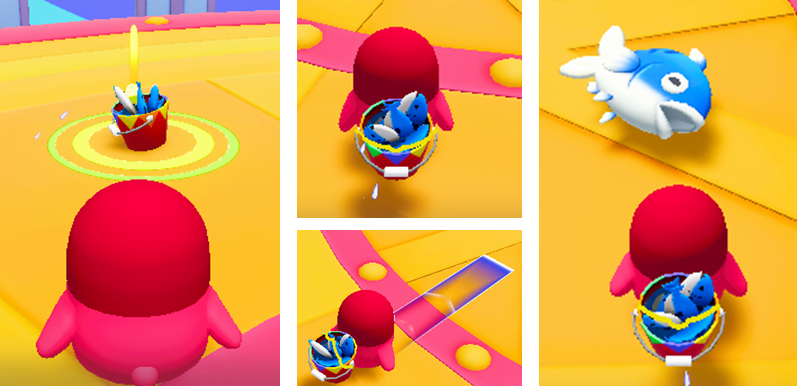

# 고등어 장치

이름 : ItemE_MackereJarMachine

 {width="400"}

게임 내에서 캐릭터가 장착하고 사용할 수 있는 아이템 중 하나입니다.  
아이템 사용 시 유저 혹은 게임 오브젝트와의 상호 작용을 통해 게임을 진행할 수 있습니다.

## 고등어 장치 주요 특징
1. 등에 매고 다니며, 아이템을 사용하면 발사체로 구성된 기믹아이템(고등어)가 생성됩니다.
2. 날아가는 고등어에 부딪히면 부딪힌 대상은 날아갑니다.
3. HUD UI 버튼을 누르고 있으면 발사 경로가 생성되며, 아이템 사용 시 발사 경로로 아이템을 발사합니다.
4. 별 크래프트를 통해 구매가 가능합니다.

## 옵션
1. 별도의 옵션을 제공하지 않습니다.

## 기능
1. 장착 아이템 장치는 이벤트를 수신 받아 작동하지 않습니다.

## 이벤트
1. 장착 아이템 장치을 사용했을 시 별도의 이벤트를 제공하지 않습니다.

## Tip
1. 발사체 오브젝트를 다양하게 변경하여 사용할 수 있습니다.

## 참고

- [버프 장치](Buff-System.md)
- [Instruction](Instruction.md)