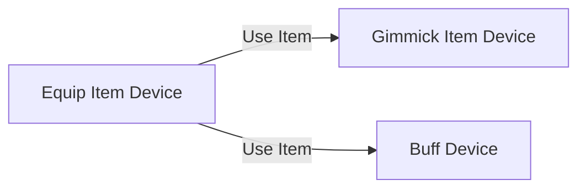

# 아이템 장치

장착 아이템 장치는 Hierarachy에서 새로운 장착 아이템 장치를 생성하거나 혹은 팔레트에서 장치를 커스텀하여 사용할 수 있습니다.  
장착 아이템 장치는 '버프 장치', '기믹 아이템 장치', '별 크래프트 기능'과 연계하여 하나의 아이템을 완성 시킬 수 있습니다.

## 주요 특징

1. 게임을 진행하는 중에, 유저가 수집 및 교환을 통해 아이템을 획득하고, 획득한 아이템을 유저가 사용할 수 있습니다.  
2. 아이템을 사용했을 때, 버프 혹은 기믹 아이템 장치와 연계되어 사용할 수 있습니다.  
3. 장치를 커스텀하여 사용자는 장치의 내부 로직에 접근할 수 있습니다.  

## 장치 사용 방식

### 아이템 구성

사용자의 제작 방식에 따라 위의 3개의 장치를 모두 연계하여 장착 아이템 제작도 가능합니다.

1. **장착 아이템 장치:** 아이템을 장착하고, 사용하는 아이템 장치입니다.
   - 캐릭터에 붙일 수 있고, 아이템 사용 효과를 설정할 수 있습니다.
2. **버프 장치:** 장착 아이템 사용 시, 제공할 버프를 설정하는 장치입니다.
   - 장착 아이템 장치와 연계하여 사용합니다.
3. **기믹 아이템 장치:** 장착 아이템 사용 시, 화면에 특정 게임 오브젝트가 출력되어야 할 경우 연계하여 사용하는 장치입니다.

## 아이템 장치 위치

### 장착 아이템

PaletteResource 윈도우 > Official 탭 > Device > 'Equip Item Device'

### 버프 아이템

PaletteResource 윈도우 > Official 탭 > Device > 'Buff Device'

## 아이템 장치 종류

<toc/>

