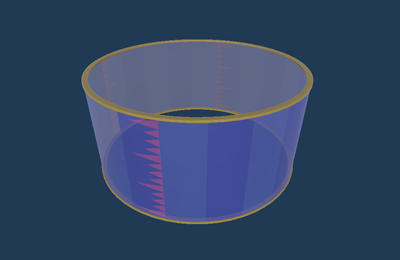
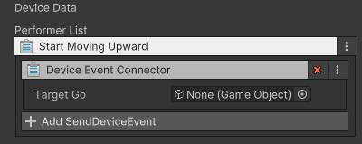

# 바운더리 장치

이름: GD_Boundary

속이 비어있는 원통형 장치로 이벤트를 받아 이동할 수 있습니다. 게임 시작 전 혹은 게임 중 사용자의 이동을 제한하는데 사용할 수 있습니다.

## 옵션
조절할 수 있는 옵션이 없습니다.

## 기능

| **이름**              | **기능**             |
|:--------------------|:-------------------|
| Start Moving Upward | 이벤트를 받아 지정된 값만큼 이동 |

## 이벤트

발생시키는 이벤트가 없습니다.