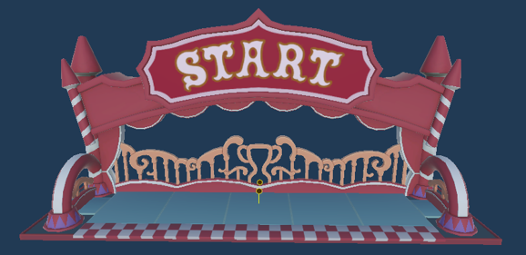
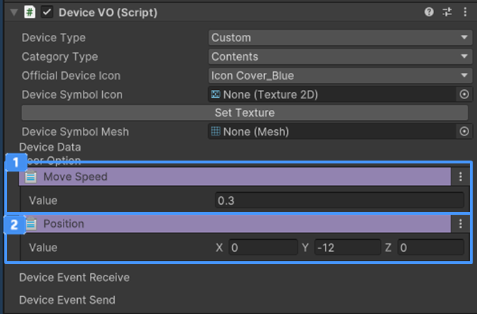

# 버프 기믹 장치

{width="400"} < 장치 이미지가 들어갈 곳

버프에 사용되고 있는 기능을 기믹 장치로 사용할 수 있는 장치입니다.  
장치를 밟으면 관련된 버프가 발동됩니다.  
버프 기믹 장치는 4종으로 구분됩니다.  

## 이름

GD_Flyup : 캐릭터를 날게하는 장치입니다
GD_BoostRun : 순간 스피드를 증가 시키는 장치입니다
GD_Mushroom : 캐릭터를 거대화 시키는 장치입니다
GD_Mushroom_Small : 캐릭터를 소형화 시키는 장치입니다.

## 옵션
GD_BoostRun 장치 옵션
 {width="400"}

| **이름**   | **내용**               |
-----------------|----------------------|
|  Speed | 달리는 속도를 설정합니다.       |
- BoostRun 외의 장치는 별도의 옵션을 제공하지 않습니다.

## 기능

- 버프 장치는 캐릭터와 연관되어 사용되기 때문에 별도의 이벤트 기능을 제공하지 않습니다.

## 이벤트

- 각각의 장치는 다음과 같은 이벤트를 제공합니다.
  - GD_Flyup
    - **On Fly-up:** 캐릭터가 장치를 밟아 날아오르면 연결된 장치는 트리거를 실행합니다.
  - GD_BoostRun
    - **On BoostRun:** 캐릭터가 장치를 밟아 빠르게 달리기 시작하면 연결된 장치는 트리거를 실행합니다
  - GD_Mushroom
    - **On Mushroom:** 캐릭터가 장치를 밟아 거대화되기 시작하면 연결된 장치는 트리거를 실행합니다
  - GD_Mushroom_Small
    - **On Mushroom_Small:** 캐릭터가 장치를 밟아 소형화되기 시작하면 연결된 장치는 트리거를 실행합니다

## 참고

- [버프 시스템](Buff-System.md)
- [장착 아이템](EquipItem-Device.md)
- [Instruction](Instruction.md)
