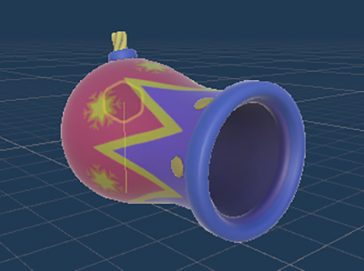
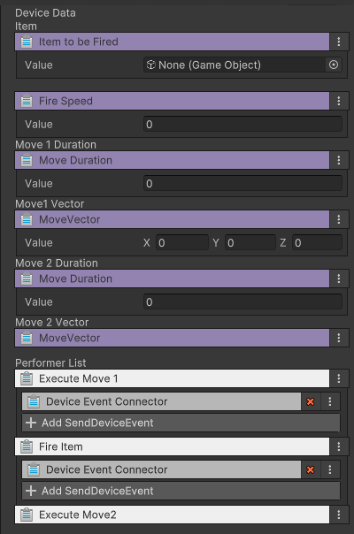

# 대포 발사 장치  
이름: GD_MovingCannon

 {width="400"}

등록된 아이템을 발사할 수 있는 기믹 장치. 이벤트를 받아 발사 하거나 이동 할 수 있다.

## 옵션  

| **이름**          | **내용**                                 |
|:----------------|:---------------------------------------|
| Fire Item       | 발사 할 아이템을 등록합니다.                       |
| Fire Speed      | 발사 된 아이템의 속도를 설정 합니다.                  |
| Move 1 Duration | 대포는 이동할 수 있습니다. 첫번째 이동에 걸리는 시간을 설정합니다. |
| Move 1 Vector   | 첫번째 이동 거리를 X,Y,Z 별로 설정합니다.             |
| Move 2 Duration | 두번째 이동에 걸리는 시간을 설정합니다.                 |
| Move 2 Vector   | 두번째 이동 거리를 X,Y,Z 별로 설정합니다.             |

## 기능

| **이름**         | **기능**           |
|:---------------|:-----------------|
| Fire Item      | 발사               |
| Execute Move 1 | 첫번째 값으로 이동       |
| Execute Move 2 | 두번째 값으로 이동 |

## 이벤트

| **이벤트** | **내용**                   |
|:--------|:-------------------------|
|      On Fired   | 대포에서 아이템을 발사했을 때 보내는 메세지 |
|      On Moved   | 각 이동을 완료했을 때 보내는 메세지     |
