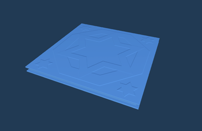
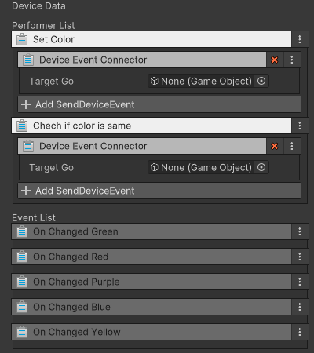

# 색상 발판 장치

이름: GD_ColorPlatform

5가지 색상 중 하나를 랜덤하게 표시하는 발판입니다. Color Switch 스테이지에서 사용되어 색상이 일치하지 않는 경우 발판이 추락하였다 제자리로 돌아옵니다.

## 옵션

## 기능

| **이름**                 | **기능**                                  |
|:-----------------------|:----------------------------------------|
| Set Color              | 이벤트를 받아 랜덤 색상을 설정                       |
| Check If Color Is Same | 이벤트를 받아 나의 색상과 외부로부터 받은 색상 메세지가 동일한지 판정 |

## 이벤트

| **이벤트**           | **내용**    |
|:------------------|:----------|
| On Changed Green  | 녹색으로 표시함  |
| On Changed Red    | 빨간색으로 표시함 |
| On Changed Purple | 보라색으로 표시함 |
| On Changed Blue   | 파란색으로 표시함 |
| On Changed Yellow | 노란색으로 표시함 |
