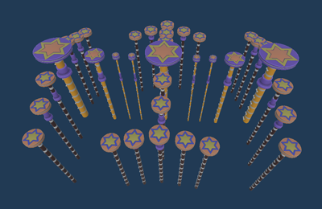
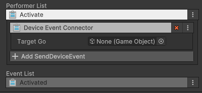

# 대피 발판 장치
이름: GD_EscapePlatform

다양한 높이와 다양한 사이즈를 가진 발판 그룹. 플레이어는 발판에서 떨어지지 않으려 노력하며 상대 플레이어를 떨어트리는 시도를 할 수 있다. 

## 옵션

조절할 수 있는 옵션이 없습니다.

## 기능

| **이름**         | **기능**            |
|:---------------|:------------------|
| Activate       | 이벤트를 받아 씬에 등장합니다. |

## 이벤트

| **이벤트**      | **내용**               |
|:-------------|:---------------------|
| On Activated | 씬에서 보여지기 시작함         |