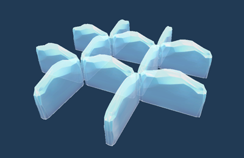
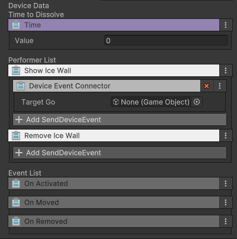

# 얼음벽 장치

이름: GD_IceWall

눈치싸움 스테이지에서 사용되며 플레이어간 이동을 제한하는 역할을 하는 얼음벽입니다.  
이벤트를 받아 등장하거나 사라지게 할 수 있으며 씬에 등장하여 사라지기까지의 시간을 설정할 수 있습니다.

## 옵션

| **이름** | **내용**                         |
|:-------|:-------------------------------|
| Time   | 이동 완료 후 디졸브 되기 전까지의 시간을 설정합니다. |

## 기능

| **이름**          | **기능**         |
|:----------------|:---------------|
| Show Ice Wall   | 이벤트를 받아 씬에 등장  |
| Remove Ice Wall | 이벤트를 받아 씬에서 소멸 |

## 이벤트

| **이벤트**      | **내용**                            |
|:-------------|:----------------------------------|
| On Activated | 동작을 시작 하였음                        |
| On Moved     | 이동을 완료 하였음                        |
| On Removed   | 씬에서 삭제 되었음 (디졸브로 사라졌으나 파괴된 것은 아님) |