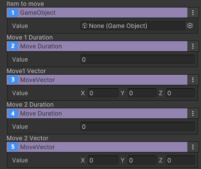

# 이동 장치

 {width="400"}

등록된 아이템을 발사할 수 있는 기믹 장치. 이벤트를 받아 발사 하거나 이동 할 수 있다.  
2개의 이동을 등록할 수 있고 이벤트를 통해 반복하도록 설정할 수 있다.

## 이름

GD_Move

## 옵션

 {width="400"}

| **이름**                                                       | **내용**                     |
|:-------------------------------------------------------------|:---------------------------|
|   이동 오브젝트 선택        | 발사된 아이템의 속도를 설정합니다.        |
|  첫번째 이동에 걸리는 시간 설정  | 첫번째 이동에 걸리는 시간을 설정합니다.     |
|   첫번째 이동 거리 설정      | 첫번째 이동 거리를 X,Y,Z 별로 설정합니다. |
|   두번째 이동에 걸리는 시간 설정 | 두번째 이동에 걸리는 시간을 설정합니다.     |
|  반복 이동 횟수 설정        | 두번째 이동 거리를 X,Y,Z 별로 설정합니다. |

## 기능

- 이벤트를 받아 첫번째 값으로 이동
- 이벤트를 받아 두번째 값으로 이동

## 이벤트

- On Moved 1
- On Moved 2