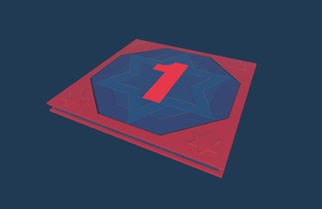
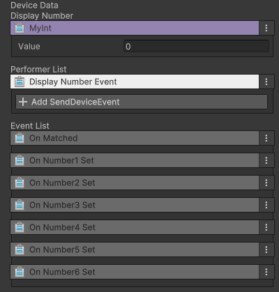

# 숫자 발판 장치

이름: GD_1to6Platform

지정받은 숫자나 랜덤한 숫자를 표시할 수 있습니다. 나의 숫자와 내 위에 충돌하고 있는 플레이어의 숫자가 일치하면 반응 합니다.  
이벤트를 받아 두 개의 숫자가 일치하지 않는 발판을 뒤집어 위에 위치한 플레이어를 추락시킬 수 있습니다. 

## 옵션

| **이름** | **내용**                             |
|:-------|:-----------------------------------|
| My Int | 내가 표시할 숫자를 설정합니다. 1~6 까지 설정 가능합니다. |

## 기능

| **이름**               | **기능**                      |
|:---------------------|:----------------------------|
| Display Number Event | 랜덤하게 1~6까지의 숫자 중 하나를 표시합니다. |

## 이벤트

| **이벤트**        | **내용**                       |
|:---------------|:-----------------------------|
| On Matched     | 나의 숫자와 충돌하고 있는 플레이어의 숫자가 일치함 |
| On Number1 Set | 1번을 표시함                      |
| On Number2 Set | 2번을 표시함                      |
| On Number3 Set | 3번을 표시함                      |
| On Number4 Set | 4번을 표시함                      |
| On Number5 Set | 5번을 표시함                      |
| On Number6 Set | 6번을 표시함                      |