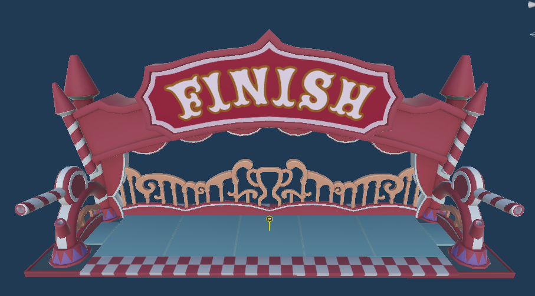
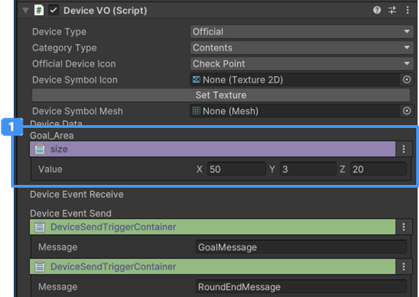

# 체크포인트 장치

 {width="400"}

체크 포인트 장치는 최종 Goal 지점으로 사용하며, 캐릭터가 트리거를 통과하면 이벤트를 실행하는 장치입니다.  
체크 포인트에 통과한 플레이어는 관전 상태로 전환되어 다른 유저의 플레이를 볼 수 있습니다.

## 이름

GD_RunFinish

## 옵션

 {width="400"}

| **이름**                                               | **내용**                |
|:-----------------------------------------------------|:----------------------|
|  Goal Area  | 골 통과 영역을 설정할 수 있습니다.  |

## 기능

별도의 이벤트 연결 기능을 지원하지 않습니다.

## 이벤트

업데이트 기능으로 추가될 예정입니다.  

| **이름**                     | **내용**                                    |
|:---------------------------|:------------------------------------------|
| Player Spectate Change     | 플레이어가 관전 상태로 진입하면 연결된 장치는 트리거를 실행합니다.     |
| layer All Spectate Change  | 모든 플레이어가 관전 상태로 진입하면 연결된 장치는 트리거를 실행합니다.  |

## 참고

- [비주얼 스크립팅](Visual-Scripting.md)
- [장치 간 이벤트 연결하기](Connect-Event-Between-Devices.md)
- [Instruction](Instruction.md)