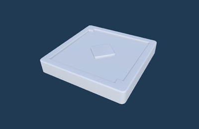

# 진짜 가짜 발판 장치

이름: GD_TrueFalsePlatform

진짜거 가짜, 설정된 값으로 동작하는 발판. 진짜 발판은 색상이 변경되고 가짜 발판은 추락합니다. 

## 옵션

| **이름** | **내용**     |
|:-------|:-----------|
| True   | 진짜 발판으로 동작 |

## 기능

| **이름**              | **기능**                 |
|:--------------------|:-----------------------|
| Check If it is True | 이벤트를 받아 가짜 발판은 추락시킵니다. |

## 이벤트

| **이벤트** | **내용**                   |
|:--------|:-------------------------|
|      On Fired   | 대포에서 아이템을 발사했을 때 보내는 메세지 |
|      On Moved   | 각 이동을 완료했을 때 보내는 메세지     |