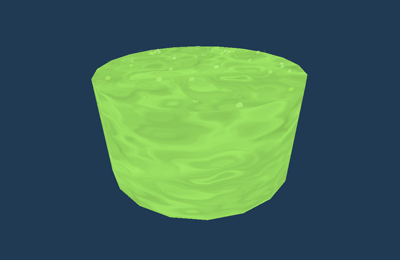
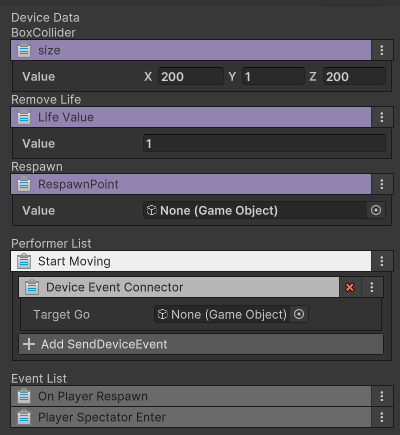

# 독액 사망 장치
GD_PoisonDeathZone

  
부글부글 끓은 독액에 닿으면 사망하는 장치 입니다. 기믹 장치 하단에 설치하여 추락 시 사망하게 처리할 수 있습니다.

## 옵션

| **이름**        | **내용**                                    |
|:--------------|:------------------------------------------|
| Size          | 사망 영역을 설정할 수 있습니다. 실제 기믹의 영역이 변경되지는 않습니다. |
| Life Value    | 사망 시 감소할 Life 개수를 설정할 수 있습니다. (0 : 제한 없음) |
| Respawn Point | 사망 시 리스폰 할  스폰 장치를 연결할 수 있습니다.            |

## 기능

| **이름**       | **기능**          |
|:-------------|:----------------|
| Start Moving | 이벤트를 이동을 시작합니다. |

## 이벤트

| **이벤트**                | **내용**                   |
|:-----------------------|:-------------------------|
| Player Spectate Enter | 플레이어가 관전 상태로 진입하면 연결된 장치는 트리거를 실행합니다. |
| On Player Respawn | 플레이어가 리스폰 되면 연결된 장치는 트리거를 실행합니다. |