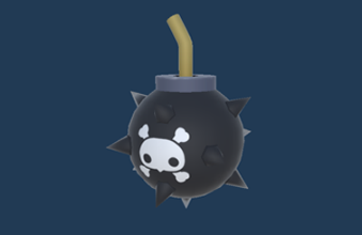
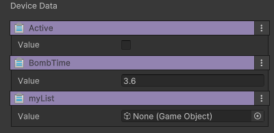

# 큰 폭탄, 작은 폭탄

장치 이름 : IGD_CannonBall

주로 아이템 생성장치나 발사장치등에 등록되어 플레이 중 동적으로 생성되는 아이템입니다.
바닥과 충돌 시 일정 시간이 지나면 폭발 합니다.

## 옵션

| **이름**       | **내용**                         |
|:-------------|:-------------------------------|
| Active       | 폭탄이 폭발을 시작합니다.                 |
| Bomb Time    | 폭발 시작으로 부터 실제 폭발까지의 시간을 설정합니다. |
| My List      | ??????                         

### 기능
조절할 수 있는 기능이 없습니다.

## 이벤트
발생시키는 이벤트가 없습니다.