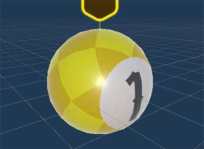
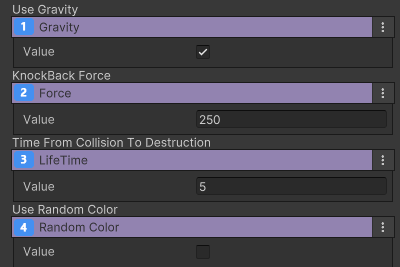

# 당구공
장치 이름 : IGD_CannonBall
 {width="400"}

주로 아이템 생성장치나 발사장치등에 등록되어 플레이 중 동적으로 생성되는 아이템입니다.
충돌 시 대상을 넉백 시킬 수 있습니다.

## 옵션

| **이름**       | **내용**                       |
|:-------------|:-----------------------------|
| Gravity      | 중력 사용 여부를 설정합니다.             |
| Force        | 부딪힌 대상을 넉백 시키는 힘을 설정합니다.     |
| Life Time    | 생성 된 후 소멸되기까지의 시간을 설정합니다.    |
| Random Color | 당구공 생성 시 랜덤 칼라 사용 여부를 설정합니다. |

### 기능
조절할 수 있는 기능이 없습니다.

## 이벤트
발생시키는 이벤트가 없습니다.